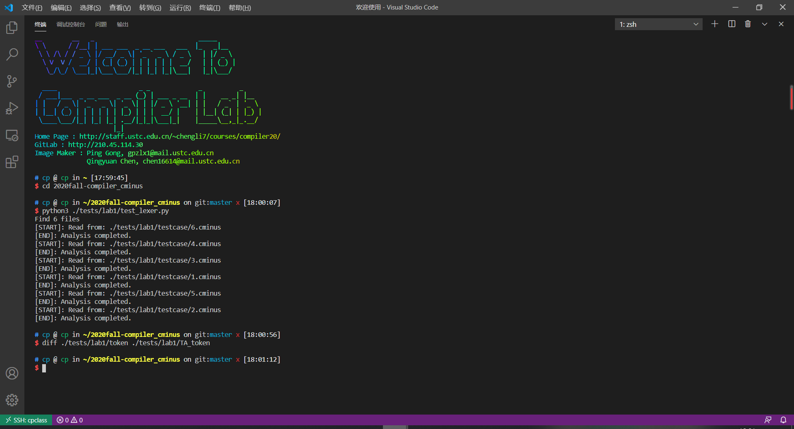
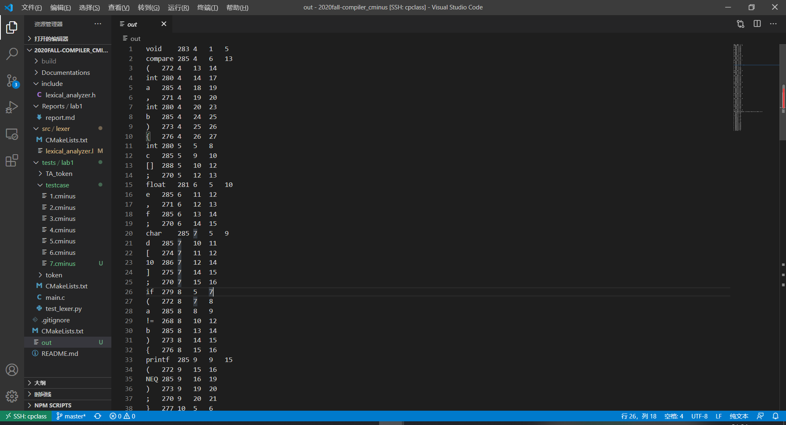
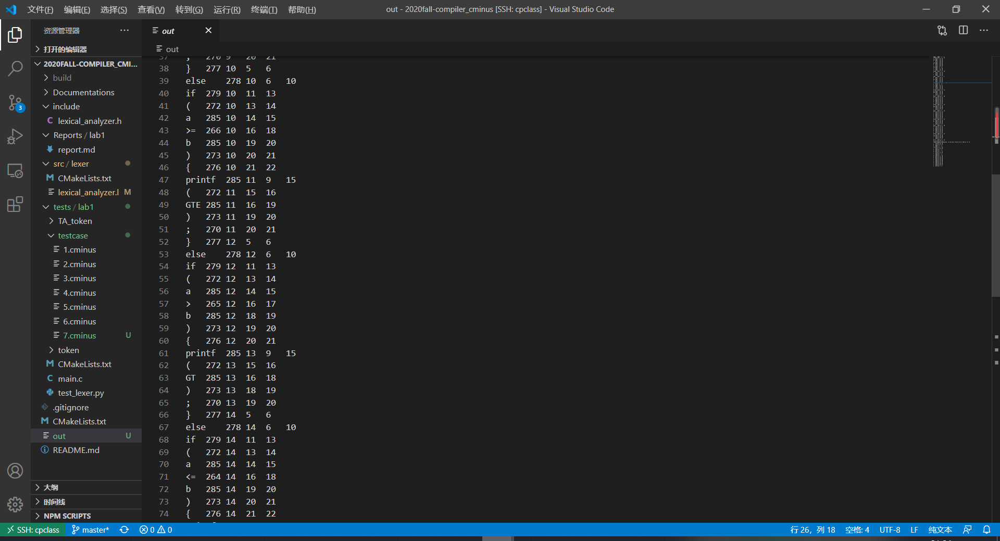
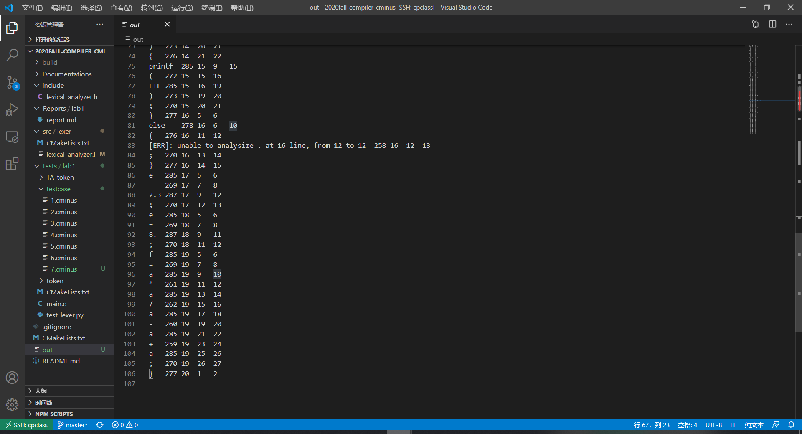

# lab1实验报告

PB18000006 范翔宇

## 实验要求

本次实验需要各位啊同学根据`cminux-f`的词法补全lexical_analyer.l文件，完成词法分析器，能够输出识别出的`token`，`type` ,`line(刚出现的行数)`，`pos_start(该行开始位置)`，`pos_end(结束的位置,不包含)`。如：

文本输入：

```c
int a;
```

则识别结果应为：

```c
int     280     1       2       5
a       284     1       6       7
;       270     1       7       8
```

**具体的需识别token参考lexical_analyzer.h**

**特别说明对于部分token，我们只需要进行过滤，即只需被识别，但是不应该被输出到分析结果中。因为这些token对程序运行不起到任何作用。**

> 注意，你所需修改的文件应仅有lexical_analyer.l。关于`FLEX`用法上文已经进行简短的介绍，更高阶的用法请参考百度、谷歌和官方说明。

### 目录结构

整个`repo`的结构如下

```c
.
├── CMakeLists.txt
├── Documentations
│   └── lab1
│       └── README.md  <- lab1实验文档说明
├── READMD.md
├── Reports
│   └── lab1
│       └── report.md  <- lab1所需提交的实验报告（你需要在此提交实验报告）
├── include <- 实验所需的头文件
│   └── lexical_analyzer.h 
├── src <- 源代码
│   └── lexer
│       ├── CMakeLists.txt
│       └── lexical_analyzer.l   <- flex文件，lab1所需完善的文件
└── tests	<- 测试文件
    └── lab1
        ├── CMakeLists.txt
        ├── main.c    <- lab1的main文件
        ├── test_lexer.py
        ├── testcase  <- 助教提供的测试样例
        └── TA_token  <- 助教提供的关于测试样例的词法分析结果
```

### 编译、运行和验证

`lab1`的代表大部分由`C`和`python`构成，使用`cmake`进行编译。

#### 编译

```c
#进入workspace
$ cd 2020fall-Compiler_CMinus
#创建build文件夹，配置编译环境
$ mkdir build 
$ cd build 
$ cmake ../
#开始编译
$ make
```

编译成功将在`${WORKSPACE}/build/`下生成`lexer`命令

#### 运行

```c
$ cd 2020fall-Compiler_CMinus
# 运行lexer命令
$ ./build/lexer
usage: lexer input_file output_file
# 我们可以简单运行下 lexer命令，但是由于此时未完成实验，当然输出错误结果
$ ./build/lexer ./tests/lab1/testcase/1.cminus out
[START]: Read from: ./tests/lab1/testcase/1.cminus
[ERR]: unable to analysize i at 1 line, from 1 to 1
......
......

$ head -n 5 out
[ERR]: unable to analysize i at 1 line, from 1 to 1     258     1       1       1
[ERR]: unable to analysize n at 1 line, from 1 to 1     258     1       1       1
[ERR]: unable to analysize t at 1 line, from 1 to 1     258     1       1       1
[ERR]: unable to analysize   at 1 line, from 1 to 1     258     1       1       1
[ERR]: unable to analysize g at 1 line, from 1 to 1     258     1       1       1
```

我们提供了`./tests/lab1/test_lexer.py` python脚本用于调用`lexer`批量完成分析任务。

```c
# test_lexer.py脚本将自动分析./tests/lab1/testcase下所有文件后缀为.cminus的文件，并将输出结果保存在./tests/lab1/token文件下下
$ python3 ./tests/lab1/test_lexer.py
	···
	···
	···
#上诉指令将在./tests/lab1/token文件夹下产生对应的分析结果
$ ls ./tests/lab1/token
1.tokens  2.tokens  3.tokens  4.tokens  5.tokens  6.tokens
```

#### 验证

我们使用`diff`指令进行验证。将自己的生成结果和助教提供的`TA_token`进行比较。

```c
$ diff ./tests/lab1/token ./tests/lab1/TA_token
# 如果结果完全正确，则没有任何输出结果
# 如果有不一致，则会汇报具体哪个文件哪部分不一致
```

请注意助教提供的`testcase`并不能涵盖全部的测试情况，完成此部分仅能拿到基础分，请自行设计自己的`testcase`进行测试。

## 实验难点

0.如何用cminus-f语法准确地表达关键字、专用符号、标识符ID和整数NUM以及注释等？

1.优先级如何确定？

2.在不同case情况下，pos_start、pos_end、lines分别该如何处理？

## 实验设计

首先补全所有flex的模式与动作。我们只需要识别字符是什么类型，然后return即可。比如int，我们会识别到INT并返回；+我们会识别到ADD并返回。对于匹配关系可参考下表 (从上到下，从左到右，优先级递减)：

| +    | ADD  | **>=** | GTE         | )    | RPARENTHESE | int       | INT        | ([0-9]+.)\|([0-9]*\.[0-9]+) | FLOATPOINT |
| ---- | ---- | ------ | ----------- | ---- | ----------- | --------- | ---------- | --------------------------- | ---------- |
| -    | SUB  | ==     | EQ          | [    | LBRACKET    | float     | FLOAT      | []                          | ARRAY      |
| *    | MUL  | !=     | NEQ         | ]    | RBRACKET    | return    | RETURN     | [a-zA-Z]                    | LETTER     |
| /    | DIV  | =      | ASSIN       | {    | LBRACE      | void      | VOID       | \n                          | EOL        |
| <    | LT   | ;      | SEMICOLON   | }    | RBRACE      | while     | WHILE      | .                           | ERROR      |
| <=   | LTE  | ,      | COMMA       | else | ELSE        | [a-zA-Z]+ | IDENTIFIER |                             |            |
| >    | GT   | (      | LPARENTHESE | if   | IF          | [0-9]+    | INTEGER    |                             |            |

便于识别，都加上引号"，如"+"。IDENTIFIER、INTEGER、FLOATPOINT、LETTER这四个不加，不然会错误识别出现奇奇怪怪的bug。

对于COMMENT，作业题里面有关于/*****...*****/形式的正则表达式：

```c
/*([^*]|(*)*[^*/])*(*)**/
```

为了识别，我们给其加上"和\：

```c
"/*"([^*]|(\*)*[^\*/])*(\*)*"*/"
```

对于BLANK，仅仅用空格表征是不全面的，如果按了一次Tab键，也是BLANK，这时候我们需要检测\t，即：

```c
" "|"\t"
```

当然我们也加上"，便于识别。

这样一一匹配，我们按下面这种格式补全即可：

```c
"+" { return ADD;}
[a-zA-Z]+ { return IDENTIFIER;}
```

至于优先级，因为C是从上到下顺序读取的，所以我们写的时候注意顺序就好了。

下一步是补全analyzer()函数，主要是针对五种case，pos_start和pos_end以及lines都该进行何种操作。

对于pos_start五个case下的操作是一样的，让其等于上一个token的pos_end，即上个token结束的地方就是这个token开始的地方；

对于pos_end和lines在五种case下操作需要分开讨论：

COMMENT注释情况下，我们需要对yytext的元素逐一分析， 正常情况下仅pos_end++即可；若遇到换行符"\n"，需要将lines++，同时pos_end归0(尽管输出的pos_end不可能为0)，然后再pos_end++即可；

BLANK空白情况下，无论是单纯的空格还是制表符"\t"，我们只对pos_end++即可；

EOL换行情况下，是换行操作，我们只需要lines++，并将pos_end置1即可；

ERROR错误情况我们不考虑(TA已经完善了)；

defualt其他情况下，只需要将pos_end += strlen(yytext)即可；

这样lexical_analyzer.l文件便全部完善。

## 实验结果验证

先验证TA的testcase，编译就不在这里体现了。

观察TA的几个cminus，发现大部分均包含，但少了LTE，GT, GTE, ERROR等。

我自己又写了一个testcase：

```c
/*PB18000006
XYFan
testcase designed by myself*/
void compare(int a,int b){
    int c[];
    float e,f;
    char d[10];/*just test***a*b/*/
    if(a != b){
        printf("NEQ");
    }else if(a >= b){
        printf("GTE");
    }else if(a > b){
        printf("GT");
    }else if(a <= b){
        printf("LTE");
    }else {.;}
    e = 2.3;
    e = 8.;
    f = a * a / a - a + a;
}
```

结果如下：





INT,VOID,FLOAT,(,),[],[,],{,},IDENTIFIER,INTEGER,=,<=,>,>=,!=,+,-,*,/,FLOATPOINT,ERROR均均识别正确，其他情况TA的6个cminus已经很清晰了，在此不做赘述。

## 实验反馈

感觉本次实验eg给的提示很不明显，让人很难琢磨透，而且flex格式也没有一个标准的要求，我也是查阅了大量资料并且咨询了很多人之后，心里才有了一个大概、模糊的模型。但熟悉之后，本次实验还是比较简单的。但是本次实验有一个致命的bug！！！LETTER跟IDENTIFIER根本无法区分，比如a，TA的token里也是将其看作一个IDENTIFIER来处理的，而不是LETTER！总的来说，本次实验一般，期待后续实验有所改善。