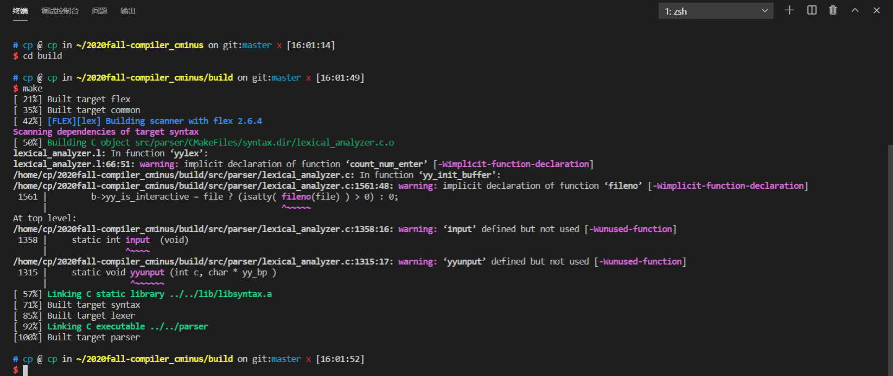
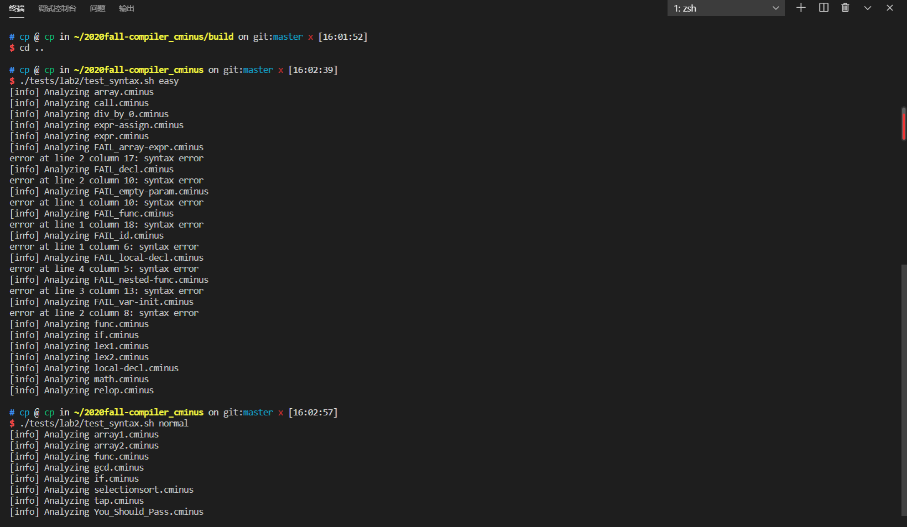
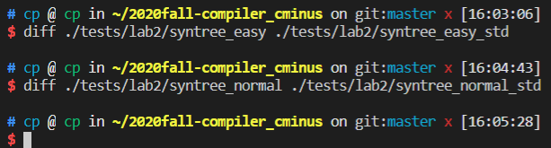
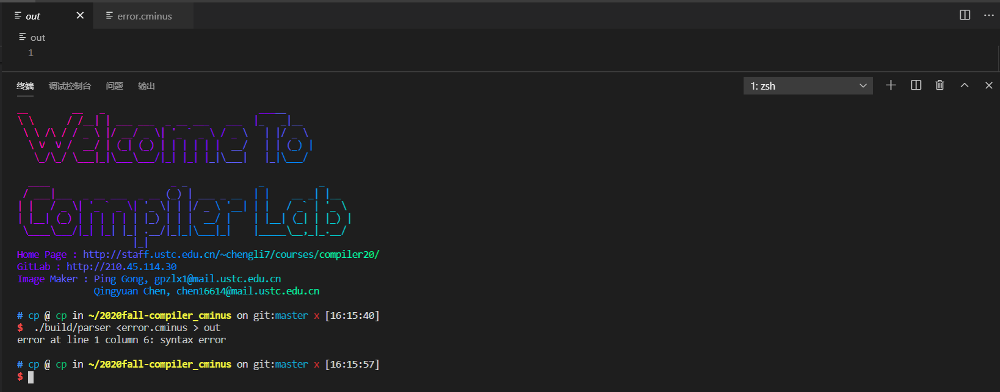

# lab2 实验报告

## PB18000006 范翔宇

## 实验要求

本次实验需要各位同学首先将自己的 lab1 的词法部分复制到 `/src/parser` 目录的 lexical_analyzer.l并合理修改相应部分，然后根据 `cminus-f` 的语法补全 syntax_analyer.y 文件，完成语法分析器，要求最终能够输出解析树。如：

输入：

```c
int bar;
float foo(void) { return 1.0; }
```

则 `parser` 将输出如下解析树：

```
>--+ program
|  >--+ declaration-list
|  |  >--+ declaration-list
|  |  |  >--+ declaration
|  |  |  |  >--+ var-declaration
|  |  |  |  |  >--+ type-specifier
|  |  |  |  |  |  >--* int
|  |  |  |  |  >--* bar
|  |  |  |  |  >--* ;
|  |  >--+ declaration
|  |  |  >--+ fun-declaration
|  |  |  |  >--+ type-specifier
|  |  |  |  |  >--* float
|  |  |  |  >--* foo
|  |  |  |  >--* (
|  |  |  |  >--+ params
|  |  |  |  |  >--* void
|  |  |  |  >--* )
|  |  |  |  >--+ compound-stmt
|  |  |  |  |  >--* {
|  |  |  |  |  >--+ local-declarations
|  |  |  |  |  |  >--* epsilon
|  |  |  |  |  >--+ statement-list
|  |  |  |  |  |  >--+ statement-list
|  |  |  |  |  |  |  >--* epsilon
|  |  |  |  |  |  >--+ statement
|  |  |  |  |  |  |  >--+ return-stmt
|  |  |  |  |  |  |  |  >--* return
|  |  |  |  |  |  |  |  >--+ expression
|  |  |  |  |  |  |  |  |  >--+ simple-expression
|  |  |  |  |  |  |  |  |  |  >--+ additive-expression
|  |  |  |  |  |  |  |  |  |  |  >--+ term
|  |  |  |  |  |  |  |  |  |  |  |  >--+ factor
|  |  |  |  |  |  |  |  |  |  |  |  |  >--+ float
|  |  |  |  |  |  |  |  |  |  |  |  |  |  >--* 1.0
|  |  |  |  |  |  |  |  >--* ;
|  |  |  |  |  >--* }
```

请注意，上述解析树含有每个解析规则的所有子成分，包括诸如 `;` `{` `}` 这样的符号，请在编写规则时务必不要忘了它们。

### 目录结构

```
.
├── CMakeLists.txt
├── Documentations
│   ├── lab1
│   └── lab2
│       ├── readings.md        <- 扩展阅读
│       └── README.md          <- lab2实验文档说明（你在这里）
├── READMD.md
├── Reports
│   ├── lab1
│   └── lab2
│       └── report.md          <- lab2所需提交的实验报告（你需要在此提交实验报告）
├── include                     <- 实验所需的头文件
│   ├── lexical_analyzer.h
│   └── SyntaxTree.h
├── src                         <- 源代码
│   ├── common
│   │   └── SyntaxTree.c      <- 分析树相关代码
│   ├── lexer
│   └── parser
│       ├── lexical_analyzer.l <- lab1 的词法部分复制到这，并进行一定改写
│       └── syntax_analyzer.y  <- lab2 需要完善的文件
└── tests                      <- 测试文件
    ├── lab1
    └── lab2                   <- lab2 测试用例文件夹
```

### 编译、运行和验证

#### 编译

与 lab1 相同。若编译成功，则将在 `${WORKSPACE}/build/` 下生成 `parser` 命令。

#### 运行

与 `lexer` 命令不同，本次实验的 `parser` 命令使用 shell 的输入重定向功能，即程序本身使用标准输入输出（stdin 和 stdout），但在 shell 运行命令时可以使用 `<` `>` 和 `>>` 灵活地自定义输出和输入从哪里来。

```shell
$ cd 2020fall-Compiler_CMinus
$ ./build/parser               # 交互式使用（不进行输入重定向）
<在这里输入 Cminus-f 代码，如果遇到了错误，将程序将报错并退出。>
<输入完成后按 ^D 结束输入，此时程序将输出解析树。>
$ ./build/parser < test.cminus # 重定向标准输入
<此时程序从 test.cminus 文件中读取输入，因此不需要输入任何内容。>
<如果遇到了错误，将程序将报错并退出；否则，将输出解析树。>
$ ./build/parser test.cminus  # 不使用重定向，直接从 test.cminus 中读入
$ ./build/parser < test.cminus > out
<此时程序从 test.cminus 文件中读取输入，因此不需要输入任何内容。>
<如果遇到了错误，将程序将报错并退出；否则，将输出解析树到 out 文件中。>
```

通过灵活使用重定向，可以比较方便地完成各种各样的需求，请同学们务必掌握这个 shell 功能。

此外，提供了 shell 脚本 `/tests/lab2/test_syntax.sh` 调用 `parser` 批量分析测试文件。注意，这个脚本假设 `parser` 在 `项目目录/build` 下。

```shell
# test_syntax.sh 脚本将自动分析 ./tests/lab2/testcase_$1 下所有文件后缀为 .cminus 的文件，并将输出结果保存在 ./tests/lab2/syntree_$1 文件夹下
$ ./tests/lab2/test_syntax.sh easy
  ...
  ...
  ...
$ ls ./tests/lab2/syntree_easy
  <成功分析的文件>
$ ./tests/lab2/test_syntax.sh normal
$ ls ./tests/lab2/syntree_normal
```

#### 验证

本次试验测试案例较多，为此我们将这些测试分为两类：

1. easy: 这部分测试均比较简单且单纯，适合开发时调试。
2. normal: 较为综合，适合完成实验后系统测试。

我们使用 `diff` 命令进行验证。将自己的生成结果和助教提供的 `xxx_std` 进行比较。

```shell
$ diff ./tests/lab2/syntree_easy ./tests/lab2/syntree_easy_std
# 如果结果完全正确，则没有任何输出结果
# 如果有不一致，则会汇报具体哪个文件哪部分不一致
# 使用 -qr 参数可以仅列出文件名
```

`test_syntax.sh` 脚本也支持自动调用 `diff`。

```shell
# test_syntax.sh 脚本将自动分析 ./tests/lab2/testcase_$1 下所有文件后缀为 .cminus 的文件，并将输出结果保存在 ./tests/lab2/syntree_$1 文件夹下
$ ./tests/lab2/test_syntax.sh easy yes
  <分析所有 .cminus 文件并将结果与标准对比，仅输出有差异的文件名>
$ ./tests/lab2/test_syntax.sh easy verbose
  <分析所有 .cminus 文件并将结果与标准对比，详细输出所有差异>
```

**请注意助教提供的`testcase`并不能涵盖全部的测试情况，完成此部分仅能拿到基础分，请自行设计自己的`testcase`进行测试。**

### 提交要求

- 本实验的提交要求分为两部分：实验部分的文件和报告，git提交的规范性。

  - 实验部分:

    - 需要完善 `./src/parser/lexical_analyzer.l` 文件;

    - 需要完善 `./src/parser/syntax_analyzer.y` 文件;

    - 需要在 

      ```
      ./Report/lab2/report.md
      ```

       撰写实验报告。

      - 实验报告内容包括:
        - 实验要求、实验难点、实验设计、实验结果验证、实验反馈(具体参考[report.md]());
        - 实验报告不参与评分标准，但是必须完成并提交.

    - 本次实验收取 `./src/parser/lexical_analyzer.l` 文件、`./src/parser/syntax_analyzer.y` 文件和 `./Report/lab2` 目录

  - git提交规范：

    - 不破坏目录结构(`report.md`所需的图片请放在`./Reports/lab2/figs/`下);
    - 不上传临时文件(凡是自动生成的文件和临时文件请不要上传);
    - git log言之有物(不强制, 请不要git commit -m 'commit 1', git commit -m 'sdfsdf'，每次commit请提交有用的comment信息)

## **实验难点**

本次实验大部分可以通过issue和助教给的lab2文档了解学习怎么code。总共分四部分，lexical_analyze.l文件怎么补充，syntax_analyze.l文件中union如何定义，tokens都有哪些，rules怎么书写？另外我们需要注意，哪些是符合cminus-f语法，哪些不是。因为cminus-f语法说实话跟C语言相比还是有很大差距的，有很多C语言内容在cminus-f会被识别成非法的，这点也需要特别注意。

## 实验设计

首先对于lexical_analyze.l文件，我们先把lab1部分对应的flex模式与动作复制粘贴到该文件。但是由于我自己的lexical_analyze.l文件，pos_start和pos_end以及lines是在analyzer函数里面处理的，所以我们选择复制粘贴gpTA 的[lexical_analyze.l](http://222.195.68.197/staff/2020fall-compiler_cminus/-/blob/TA-impl/src/lexer/lexical_analyzer.l)这部分代码。之后我们要对其进行部分修改，首先给每个token的动作中都加上pass_node(yytext)，便于yylval协同工作，另外把EOL BLANK COMMENT ERROR这四个的动作中除去return动作，因为我们的树中不包含这四个token，不需要return。这样lexical_analyze.l文件就补充完成了。接下来九九四syntax_analyze.l文件，union我们只定义一个syntax_tree_node* node，所有token都是分析树中的结点，即：

```
%union {
    //PB18000006 ONLY
    //only node
    syntax_tree_node* node;
}
```

下面是tokens的确定，首先分两种类型token和type。大写的ADD这些我们在lab1里面用过的，除了EOL BLANK COMMENT和ERROR这四个，其他均为token，即终结符，按下面格式编程：

```
%token <node> ADD
```

对于type，是lab2新增的非终结符，均为type，按下面格式编程：

```
%type <node> param-list
```

另外program虽然声明为start，但仍要在type中出现一次。最后就是rules的编写，其实很简单很机械，按照lab2文档中cminus-f语法一五一十“翻译”过来就行了，比如：

```
declaration-list→declaration-list declaration ∣ declaration
```

我们编码成：

```
declaration-list : declaration-list declaration{ $$ = node("declaration-list", 2, $1, $2); }
                 | declaration { $$ = node("declaration-list", 1, $1); }
```

emmmmm这部分反正就比较机械。值得注意的是，empty我们直接用空格" "代替，然后对应{ $$ = node("XXX", 0); }

## 实验结果验证

### 编译



编译成功

### 运行

)

我们可以看到，除了FAIL前缀cminus文件，其他均通过。（吐槽，为啥不在实验文档里面提一嘴FAIL文件本来就是有错误的）

### 验证



我们可以看到，easy和normal文件夹中的cminus生成的对应的分析树与TA的没有区别。

为了进一步验证，我自己设置了一个testcase(mytestcase.cminus)：

```c
/*      this testcase

    code by PB18000006 XYFan
Let's start XD*/
void ADD(int g,float h,int z[]){
    float i;
    int g;
    float h;
    i = g + 2 * h;
    
    i = i - 3 * g;
}
void MUL(int g,float h,int z[]){
    float i;
    int g;
    float h;
    i = g * 2 * h;
    i = i / 3;
}
int main(void){
    int a;
    float b;
    void c;/*type-specifier*/
    float e[100];
    a = 1;
    b = 0.1;
    b = 1.1;
    b = .1;
    b = 1.;
    while(a <= 100)
    {
        if(b < 50){
            b = b + 1;
        }else if(b == 50){
            b = b + 2;
        }else{
            b = b + 3.3;
        }
    }
    ADD(a,b);
    MUL(a,b);
    return 0;
}
```

运行out结果如下：(截图太麻烦了，我直接复制粘贴了~)

```
>--+ program
|  >--+ declaration-list
|  |  >--+ declaration-list
|  |  |  >--+ declaration-list
|  |  |  |  >--+ declaration
|  |  |  |  |  >--+ fun-declaration
|  |  |  |  |  |  >--+ type-specifier
|  |  |  |  |  |  |  >--* void
|  |  |  |  |  |  >--* ADD
|  |  |  |  |  |  >--* (
|  |  |  |  |  |  >--+ params
|  |  |  |  |  |  |  >--+ param-list
|  |  |  |  |  |  |  |  >--+ param-list
|  |  |  |  |  |  |  |  |  >--+ param-list
|  |  |  |  |  |  |  |  |  |  >--+ param
|  |  |  |  |  |  |  |  |  |  |  >--+ type-specifier
|  |  |  |  |  |  |  |  |  |  |  |  >--* int
|  |  |  |  |  |  |  |  |  |  |  >--* g
|  |  |  |  |  |  |  |  |  >--* ,
|  |  |  |  |  |  |  |  |  >--+ param
|  |  |  |  |  |  |  |  |  |  >--+ type-specifier
|  |  |  |  |  |  |  |  |  |  |  >--* float
|  |  |  |  |  |  |  |  |  |  >--* h
|  |  |  |  |  |  |  |  >--* ,
|  |  |  |  |  |  |  |  >--+ param
|  |  |  |  |  |  |  |  |  >--+ type-specifier
|  |  |  |  |  |  |  |  |  |  >--* int
|  |  |  |  |  |  |  |  |  >--* z
|  |  |  |  |  |  |  |  |  >--* []
|  |  |  |  |  |  >--* )
|  |  |  |  |  |  >--+ compound-stmt
|  |  |  |  |  |  |  >--* {
|  |  |  |  |  |  |  >--+ local-declarations
|  |  |  |  |  |  |  |  >--+ local-declarations
|  |  |  |  |  |  |  |  |  >--+ local-declarations
|  |  |  |  |  |  |  |  |  |  >--+ local-declarations
|  |  |  |  |  |  |  |  |  |  |  >--* epsilon
|  |  |  |  |  |  |  |  |  |  >--+ var-declaration
|  |  |  |  |  |  |  |  |  |  |  >--+ type-specifier
|  |  |  |  |  |  |  |  |  |  |  |  >--* float
|  |  |  |  |  |  |  |  |  |  |  >--* i
|  |  |  |  |  |  |  |  |  |  |  >--* ;
|  |  |  |  |  |  |  |  |  >--+ var-declaration
|  |  |  |  |  |  |  |  |  |  >--+ type-specifier
|  |  |  |  |  |  |  |  |  |  |  >--* int
|  |  |  |  |  |  |  |  |  |  >--* g
|  |  |  |  |  |  |  |  |  |  >--* ;
|  |  |  |  |  |  |  |  >--+ var-declaration
|  |  |  |  |  |  |  |  |  >--+ type-specifier
|  |  |  |  |  |  |  |  |  |  >--* float
|  |  |  |  |  |  |  |  |  >--* h
|  |  |  |  |  |  |  |  |  >--* ;
|  |  |  |  |  |  |  >--+ statement-list
|  |  |  |  |  |  |  |  >--+ statement-list
|  |  |  |  |  |  |  |  |  >--+ statement-list
|  |  |  |  |  |  |  |  |  |  >--* epsilon
|  |  |  |  |  |  |  |  |  >--+ statement
|  |  |  |  |  |  |  |  |  |  >--+ expression-stmt
|  |  |  |  |  |  |  |  |  |  |  >--+ expression
|  |  |  |  |  |  |  |  |  |  |  |  >--+ var
|  |  |  |  |  |  |  |  |  |  |  |  |  >--* i
|  |  |  |  |  |  |  |  |  |  |  |  >--* =
|  |  |  |  |  |  |  |  |  |  |  |  >--+ expression
|  |  |  |  |  |  |  |  |  |  |  |  |  >--+ simple-expression
|  |  |  |  |  |  |  |  |  |  |  |  |  |  >--+ additive-expression
|  |  |  |  |  |  |  |  |  |  |  |  |  |  |  >--+ additive-expression
|  |  |  |  |  |  |  |  |  |  |  |  |  |  |  |  >--+ term
|  |  |  |  |  |  |  |  |  |  |  |  |  |  |  |  |  >--+ factor
|  |  |  |  |  |  |  |  |  |  |  |  |  |  |  |  |  |  >--+ var
|  |  |  |  |  |  |  |  |  |  |  |  |  |  |  |  |  |  |  >--* g
|  |  |  |  |  |  |  |  |  |  |  |  |  |  |  >--+ addop
|  |  |  |  |  |  |  |  |  |  |  |  |  |  |  |  >--* +
|  |  |  |  |  |  |  |  |  |  |  |  |  |  |  >--+ term
|  |  |  |  |  |  |  |  |  |  |  |  |  |  |  |  >--+ term
|  |  |  |  |  |  |  |  |  |  |  |  |  |  |  |  |  >--+ factor
|  |  |  |  |  |  |  |  |  |  |  |  |  |  |  |  |  |  >--+ integer
|  |  |  |  |  |  |  |  |  |  |  |  |  |  |  |  |  |  |  >--* 2
|  |  |  |  |  |  |  |  |  |  |  |  |  |  |  |  >--+ mulop
|  |  |  |  |  |  |  |  |  |  |  |  |  |  |  |  |  >--* *
|  |  |  |  |  |  |  |  |  |  |  |  |  |  |  |  >--+ factor
|  |  |  |  |  |  |  |  |  |  |  |  |  |  |  |  |  >--+ var
|  |  |  |  |  |  |  |  |  |  |  |  |  |  |  |  |  |  >--* h
|  |  |  |  |  |  |  |  |  |  |  >--* ;
|  |  |  |  |  |  |  |  >--+ statement
|  |  |  |  |  |  |  |  |  >--+ expression-stmt
|  |  |  |  |  |  |  |  |  |  >--+ expression
|  |  |  |  |  |  |  |  |  |  |  >--+ var
|  |  |  |  |  |  |  |  |  |  |  |  >--* i
|  |  |  |  |  |  |  |  |  |  |  >--* =
|  |  |  |  |  |  |  |  |  |  |  >--+ expression
|  |  |  |  |  |  |  |  |  |  |  |  >--+ simple-expression
|  |  |  |  |  |  |  |  |  |  |  |  |  >--+ additive-expression
|  |  |  |  |  |  |  |  |  |  |  |  |  |  >--+ additive-expression
|  |  |  |  |  |  |  |  |  |  |  |  |  |  |  >--+ term
|  |  |  |  |  |  |  |  |  |  |  |  |  |  |  |  >--+ factor
|  |  |  |  |  |  |  |  |  |  |  |  |  |  |  |  |  >--+ var
|  |  |  |  |  |  |  |  |  |  |  |  |  |  |  |  |  |  >--* i
|  |  |  |  |  |  |  |  |  |  |  |  |  |  >--+ addop
|  |  |  |  |  |  |  |  |  |  |  |  |  |  |  >--* -
|  |  |  |  |  |  |  |  |  |  |  |  |  |  >--+ term
|  |  |  |  |  |  |  |  |  |  |  |  |  |  |  >--+ term
|  |  |  |  |  |  |  |  |  |  |  |  |  |  |  |  >--+ factor
|  |  |  |  |  |  |  |  |  |  |  |  |  |  |  |  |  >--+ integer
|  |  |  |  |  |  |  |  |  |  |  |  |  |  |  |  |  |  >--* 3
|  |  |  |  |  |  |  |  |  |  |  |  |  |  |  >--+ mulop
|  |  |  |  |  |  |  |  |  |  |  |  |  |  |  |  >--* *
|  |  |  |  |  |  |  |  |  |  |  |  |  |  |  >--+ factor
|  |  |  |  |  |  |  |  |  |  |  |  |  |  |  |  >--+ var
|  |  |  |  |  |  |  |  |  |  |  |  |  |  |  |  |  >--* g
|  |  |  |  |  |  |  |  |  |  >--* ;
|  |  |  |  |  |  |  >--* }
|  |  |  >--+ declaration
|  |  |  |  >--+ fun-declaration
|  |  |  |  |  >--+ type-specifier
|  |  |  |  |  |  >--* void
|  |  |  |  |  >--* MUL
|  |  |  |  |  >--* (
|  |  |  |  |  >--+ params
|  |  |  |  |  |  >--+ param-list
|  |  |  |  |  |  |  >--+ param-list
|  |  |  |  |  |  |  |  >--+ param-list
|  |  |  |  |  |  |  |  |  >--+ param
|  |  |  |  |  |  |  |  |  |  >--+ type-specifier
|  |  |  |  |  |  |  |  |  |  |  >--* int
|  |  |  |  |  |  |  |  |  |  >--* g
|  |  |  |  |  |  |  |  >--* ,
|  |  |  |  |  |  |  |  >--+ param
|  |  |  |  |  |  |  |  |  >--+ type-specifier
|  |  |  |  |  |  |  |  |  |  >--* float
|  |  |  |  |  |  |  |  |  >--* h
|  |  |  |  |  |  |  >--* ,
|  |  |  |  |  |  |  >--+ param
|  |  |  |  |  |  |  |  >--+ type-specifier
|  |  |  |  |  |  |  |  |  >--* int
|  |  |  |  |  |  |  |  >--* z
|  |  |  |  |  |  |  |  >--* []
|  |  |  |  |  >--* )
|  |  |  |  |  >--+ compound-stmt
|  |  |  |  |  |  >--* {
|  |  |  |  |  |  >--+ local-declarations
|  |  |  |  |  |  |  >--+ local-declarations
|  |  |  |  |  |  |  |  >--+ local-declarations
|  |  |  |  |  |  |  |  |  >--+ local-declarations
|  |  |  |  |  |  |  |  |  |  >--* epsilon
|  |  |  |  |  |  |  |  |  >--+ var-declaration
|  |  |  |  |  |  |  |  |  |  >--+ type-specifier
|  |  |  |  |  |  |  |  |  |  |  >--* float
|  |  |  |  |  |  |  |  |  |  >--* i
|  |  |  |  |  |  |  |  |  |  >--* ;
|  |  |  |  |  |  |  |  >--+ var-declaration
|  |  |  |  |  |  |  |  |  >--+ type-specifier
|  |  |  |  |  |  |  |  |  |  >--* int
|  |  |  |  |  |  |  |  |  >--* g
|  |  |  |  |  |  |  |  |  >--* ;
|  |  |  |  |  |  |  >--+ var-declaration
|  |  |  |  |  |  |  |  >--+ type-specifier
|  |  |  |  |  |  |  |  |  >--* float
|  |  |  |  |  |  |  |  >--* h
|  |  |  |  |  |  |  |  >--* ;
|  |  |  |  |  |  >--+ statement-list
|  |  |  |  |  |  |  >--+ statement-list
|  |  |  |  |  |  |  |  >--+ statement-list
|  |  |  |  |  |  |  |  |  >--* epsilon
|  |  |  |  |  |  |  |  >--+ statement
|  |  |  |  |  |  |  |  |  >--+ expression-stmt
|  |  |  |  |  |  |  |  |  |  >--+ expression
|  |  |  |  |  |  |  |  |  |  |  >--+ var
|  |  |  |  |  |  |  |  |  |  |  |  >--* i
|  |  |  |  |  |  |  |  |  |  |  >--* =
|  |  |  |  |  |  |  |  |  |  |  >--+ expression
|  |  |  |  |  |  |  |  |  |  |  |  >--+ simple-expression
|  |  |  |  |  |  |  |  |  |  |  |  |  >--+ additive-expression
|  |  |  |  |  |  |  |  |  |  |  |  |  |  >--+ term
|  |  |  |  |  |  |  |  |  |  |  |  |  |  |  >--+ term
|  |  |  |  |  |  |  |  |  |  |  |  |  |  |  |  >--+ term
|  |  |  |  |  |  |  |  |  |  |  |  |  |  |  |  |  >--+ factor
|  |  |  |  |  |  |  |  |  |  |  |  |  |  |  |  |  |  >--+ var
|  |  |  |  |  |  |  |  |  |  |  |  |  |  |  |  |  |  |  >--* g
|  |  |  |  |  |  |  |  |  |  |  |  |  |  |  |  >--+ mulop
|  |  |  |  |  |  |  |  |  |  |  |  |  |  |  |  |  >--* *
|  |  |  |  |  |  |  |  |  |  |  |  |  |  |  |  >--+ factor
|  |  |  |  |  |  |  |  |  |  |  |  |  |  |  |  |  >--+ integer
|  |  |  |  |  |  |  |  |  |  |  |  |  |  |  |  |  |  >--* 2
|  |  |  |  |  |  |  |  |  |  |  |  |  |  |  >--+ mulop
|  |  |  |  |  |  |  |  |  |  |  |  |  |  |  |  >--* *
|  |  |  |  |  |  |  |  |  |  |  |  |  |  |  >--+ factor
|  |  |  |  |  |  |  |  |  |  |  |  |  |  |  |  >--+ var
|  |  |  |  |  |  |  |  |  |  |  |  |  |  |  |  |  >--* h
|  |  |  |  |  |  |  |  |  |  >--* ;
|  |  |  |  |  |  |  >--+ statement
|  |  |  |  |  |  |  |  >--+ expression-stmt
|  |  |  |  |  |  |  |  |  >--+ expression
|  |  |  |  |  |  |  |  |  |  >--+ var
|  |  |  |  |  |  |  |  |  |  |  >--* i
|  |  |  |  |  |  |  |  |  |  >--* =
|  |  |  |  |  |  |  |  |  |  >--+ expression
|  |  |  |  |  |  |  |  |  |  |  >--+ simple-expression
|  |  |  |  |  |  |  |  |  |  |  |  >--+ additive-expression
|  |  |  |  |  |  |  |  |  |  |  |  |  >--+ term
|  |  |  |  |  |  |  |  |  |  |  |  |  |  >--+ term
|  |  |  |  |  |  |  |  |  |  |  |  |  |  |  >--+ factor
|  |  |  |  |  |  |  |  |  |  |  |  |  |  |  |  >--+ var
|  |  |  |  |  |  |  |  |  |  |  |  |  |  |  |  |  >--* i
|  |  |  |  |  |  |  |  |  |  |  |  |  |  >--+ mulop
|  |  |  |  |  |  |  |  |  |  |  |  |  |  |  >--* /
|  |  |  |  |  |  |  |  |  |  |  |  |  |  >--+ factor
|  |  |  |  |  |  |  |  |  |  |  |  |  |  |  >--+ integer
|  |  |  |  |  |  |  |  |  |  |  |  |  |  |  |  >--* 3
|  |  |  |  |  |  |  |  |  >--* ;
|  |  |  |  |  |  >--* }
|  |  >--+ declaration
|  |  |  >--+ fun-declaration
|  |  |  |  >--+ type-specifier
|  |  |  |  |  >--* int
|  |  |  |  >--* main
|  |  |  |  >--* (
|  |  |  |  >--+ params
|  |  |  |  |  >--* void
|  |  |  |  >--* )
|  |  |  |  >--+ compound-stmt
|  |  |  |  |  >--* {
|  |  |  |  |  >--+ local-declarations
|  |  |  |  |  |  >--+ local-declarations
|  |  |  |  |  |  |  >--+ local-declarations
|  |  |  |  |  |  |  |  >--+ local-declarations
|  |  |  |  |  |  |  |  |  >--+ local-declarations
|  |  |  |  |  |  |  |  |  |  >--* epsilon
|  |  |  |  |  |  |  |  |  >--+ var-declaration
|  |  |  |  |  |  |  |  |  |  >--+ type-specifier
|  |  |  |  |  |  |  |  |  |  |  >--* int
|  |  |  |  |  |  |  |  |  |  >--* a
|  |  |  |  |  |  |  |  |  |  >--* ;
|  |  |  |  |  |  |  |  >--+ var-declaration
|  |  |  |  |  |  |  |  |  >--+ type-specifier
|  |  |  |  |  |  |  |  |  |  >--* float
|  |  |  |  |  |  |  |  |  >--* b
|  |  |  |  |  |  |  |  |  >--* ;
|  |  |  |  |  |  |  >--+ var-declaration
|  |  |  |  |  |  |  |  >--+ type-specifier
|  |  |  |  |  |  |  |  |  >--* void
|  |  |  |  |  |  |  |  >--* c
|  |  |  |  |  |  |  |  >--* ;
|  |  |  |  |  |  >--+ var-declaration
|  |  |  |  |  |  |  >--+ type-specifier
|  |  |  |  |  |  |  |  >--* float
|  |  |  |  |  |  |  >--* e
|  |  |  |  |  |  |  >--* [
|  |  |  |  |  |  |  >--* 100
|  |  |  |  |  |  |  >--* ]
|  |  |  |  |  |  |  >--* ;
|  |  |  |  |  >--+ statement-list
|  |  |  |  |  |  >--+ statement-list
|  |  |  |  |  |  |  >--+ statement-list
|  |  |  |  |  |  |  |  >--+ statement-list
|  |  |  |  |  |  |  |  |  >--+ statement-list
|  |  |  |  |  |  |  |  |  |  >--+ statement-list
|  |  |  |  |  |  |  |  |  |  |  >--+ statement-list
|  |  |  |  |  |  |  |  |  |  |  |  >--+ statement-list
|  |  |  |  |  |  |  |  |  |  |  |  |  >--+ statement-list
|  |  |  |  |  |  |  |  |  |  |  |  |  |  >--+ statement-list
|  |  |  |  |  |  |  |  |  |  |  |  |  |  |  >--* epsilon
|  |  |  |  |  |  |  |  |  |  |  |  |  |  >--+ statement
|  |  |  |  |  |  |  |  |  |  |  |  |  |  |  >--+ expression-stmt
|  |  |  |  |  |  |  |  |  |  |  |  |  |  |  |  >--+ expression
|  |  |  |  |  |  |  |  |  |  |  |  |  |  |  |  |  >--+ var
|  |  |  |  |  |  |  |  |  |  |  |  |  |  |  |  |  |  >--* a
|  |  |  |  |  |  |  |  |  |  |  |  |  |  |  |  |  >--* =
|  |  |  |  |  |  |  |  |  |  |  |  |  |  |  |  |  >--+ expression
|  |  |  |  |  |  |  |  |  |  |  |  |  |  |  |  |  |  >--+ simple-expression
|  |  |  |  |  |  |  |  |  |  |  |  |  |  |  |  |  |  |  >--+ additive-expression
|  |  |  |  |  |  |  |  |  |  |  |  |  |  |  |  |  |  |  |  >--+ term
|  |  |  |  |  |  |  |  |  |  |  |  |  |  |  |  |  |  |  |  |  >--+ factor
|  |  |  |  |  |  |  |  |  |  |  |  |  |  |  |  |  |  |  |  |  |  >--+ integer
|  |  |  |  |  |  |  |  |  |  |  |  |  |  |  |  |  |  |  |  |  |  |  >--* 1
|  |  |  |  |  |  |  |  |  |  |  |  |  |  |  |  >--* ;
|  |  |  |  |  |  |  |  |  |  |  |  |  >--+ statement
|  |  |  |  |  |  |  |  |  |  |  |  |  |  >--+ expression-stmt
|  |  |  |  |  |  |  |  |  |  |  |  |  |  |  >--+ expression
|  |  |  |  |  |  |  |  |  |  |  |  |  |  |  |  >--+ var
|  |  |  |  |  |  |  |  |  |  |  |  |  |  |  |  |  >--* b
|  |  |  |  |  |  |  |  |  |  |  |  |  |  |  |  >--* =
|  |  |  |  |  |  |  |  |  |  |  |  |  |  |  |  >--+ expression
|  |  |  |  |  |  |  |  |  |  |  |  |  |  |  |  |  >--+ simple-expression
|  |  |  |  |  |  |  |  |  |  |  |  |  |  |  |  |  |  >--+ additive-expression
|  |  |  |  |  |  |  |  |  |  |  |  |  |  |  |  |  |  |  >--+ term
|  |  |  |  |  |  |  |  |  |  |  |  |  |  |  |  |  |  |  |  >--+ factor
|  |  |  |  |  |  |  |  |  |  |  |  |  |  |  |  |  |  |  |  |  >--+ float
|  |  |  |  |  |  |  |  |  |  |  |  |  |  |  |  |  |  |  |  |  |  >--* 0.1
|  |  |  |  |  |  |  |  |  |  |  |  |  |  |  >--* ;
|  |  |  |  |  |  |  |  |  |  |  |  >--+ statement
|  |  |  |  |  |  |  |  |  |  |  |  |  >--+ expression-stmt
|  |  |  |  |  |  |  |  |  |  |  |  |  |  >--+ expression
|  |  |  |  |  |  |  |  |  |  |  |  |  |  |  >--+ var
|  |  |  |  |  |  |  |  |  |  |  |  |  |  |  |  >--* b
|  |  |  |  |  |  |  |  |  |  |  |  |  |  |  >--* =
|  |  |  |  |  |  |  |  |  |  |  |  |  |  |  >--+ expression
|  |  |  |  |  |  |  |  |  |  |  |  |  |  |  |  >--+ simple-expression
|  |  |  |  |  |  |  |  |  |  |  |  |  |  |  |  |  >--+ additive-expression
|  |  |  |  |  |  |  |  |  |  |  |  |  |  |  |  |  |  >--+ term
|  |  |  |  |  |  |  |  |  |  |  |  |  |  |  |  |  |  |  >--+ factor
|  |  |  |  |  |  |  |  |  |  |  |  |  |  |  |  |  |  |  |  >--+ float
|  |  |  |  |  |  |  |  |  |  |  |  |  |  |  |  |  |  |  |  |  >--* 1.1
|  |  |  |  |  |  |  |  |  |  |  |  |  |  >--* ;
|  |  |  |  |  |  |  |  |  |  |  >--+ statement
|  |  |  |  |  |  |  |  |  |  |  |  >--+ expression-stmt
|  |  |  |  |  |  |  |  |  |  |  |  |  >--+ expression
|  |  |  |  |  |  |  |  |  |  |  |  |  |  >--+ var
|  |  |  |  |  |  |  |  |  |  |  |  |  |  |  >--* b
|  |  |  |  |  |  |  |  |  |  |  |  |  |  >--* =
|  |  |  |  |  |  |  |  |  |  |  |  |  |  >--+ expression
|  |  |  |  |  |  |  |  |  |  |  |  |  |  |  >--+ simple-expression
|  |  |  |  |  |  |  |  |  |  |  |  |  |  |  |  >--+ additive-expression
|  |  |  |  |  |  |  |  |  |  |  |  |  |  |  |  |  >--+ term
|  |  |  |  |  |  |  |  |  |  |  |  |  |  |  |  |  |  >--+ factor
|  |  |  |  |  |  |  |  |  |  |  |  |  |  |  |  |  |  |  >--+ float
|  |  |  |  |  |  |  |  |  |  |  |  |  |  |  |  |  |  |  |  >--* .1
|  |  |  |  |  |  |  |  |  |  |  |  |  >--* ;
|  |  |  |  |  |  |  |  |  |  >--+ statement
|  |  |  |  |  |  |  |  |  |  |  >--+ expression-stmt
|  |  |  |  |  |  |  |  |  |  |  |  >--+ expression
|  |  |  |  |  |  |  |  |  |  |  |  |  >--+ var
|  |  |  |  |  |  |  |  |  |  |  |  |  |  >--* b
|  |  |  |  |  |  |  |  |  |  |  |  |  >--* =
|  |  |  |  |  |  |  |  |  |  |  |  |  >--+ expression
|  |  |  |  |  |  |  |  |  |  |  |  |  |  >--+ simple-expression
|  |  |  |  |  |  |  |  |  |  |  |  |  |  |  >--+ additive-expression
|  |  |  |  |  |  |  |  |  |  |  |  |  |  |  |  >--+ term
|  |  |  |  |  |  |  |  |  |  |  |  |  |  |  |  |  >--+ factor
|  |  |  |  |  |  |  |  |  |  |  |  |  |  |  |  |  |  >--+ float
|  |  |  |  |  |  |  |  |  |  |  |  |  |  |  |  |  |  |  >--* 1.
|  |  |  |  |  |  |  |  |  |  |  |  >--* ;
|  |  |  |  |  |  |  |  |  >--+ statement
|  |  |  |  |  |  |  |  |  |  >--+ iteration-stmt
|  |  |  |  |  |  |  |  |  |  |  >--* while
|  |  |  |  |  |  |  |  |  |  |  >--* (
|  |  |  |  |  |  |  |  |  |  |  >--+ expression
|  |  |  |  |  |  |  |  |  |  |  |  >--+ simple-expression
|  |  |  |  |  |  |  |  |  |  |  |  |  >--+ additive-expression
|  |  |  |  |  |  |  |  |  |  |  |  |  |  >--+ term
|  |  |  |  |  |  |  |  |  |  |  |  |  |  |  >--+ factor
|  |  |  |  |  |  |  |  |  |  |  |  |  |  |  |  >--+ var
|  |  |  |  |  |  |  |  |  |  |  |  |  |  |  |  |  >--* a
|  |  |  |  |  |  |  |  |  |  |  |  |  >--+ relop
|  |  |  |  |  |  |  |  |  |  |  |  |  |  >--* <=
|  |  |  |  |  |  |  |  |  |  |  |  |  >--+ additive-expression
|  |  |  |  |  |  |  |  |  |  |  |  |  |  >--+ term
|  |  |  |  |  |  |  |  |  |  |  |  |  |  |  >--+ factor
|  |  |  |  |  |  |  |  |  |  |  |  |  |  |  |  >--+ integer
|  |  |  |  |  |  |  |  |  |  |  |  |  |  |  |  |  >--* 100
|  |  |  |  |  |  |  |  |  |  |  >--* )
|  |  |  |  |  |  |  |  |  |  |  >--+ statement
|  |  |  |  |  |  |  |  |  |  |  |  >--+ compound-stmt
|  |  |  |  |  |  |  |  |  |  |  |  |  >--* {
|  |  |  |  |  |  |  |  |  |  |  |  |  >--+ local-declarations
|  |  |  |  |  |  |  |  |  |  |  |  |  |  >--* epsilon
|  |  |  |  |  |  |  |  |  |  |  |  |  >--+ statement-list
|  |  |  |  |  |  |  |  |  |  |  |  |  |  >--+ statement-list
|  |  |  |  |  |  |  |  |  |  |  |  |  |  |  >--* epsilon
|  |  |  |  |  |  |  |  |  |  |  |  |  |  >--+ statement
|  |  |  |  |  |  |  |  |  |  |  |  |  |  |  >--+ selection-stmt
|  |  |  |  |  |  |  |  |  |  |  |  |  |  |  |  >--* if
|  |  |  |  |  |  |  |  |  |  |  |  |  |  |  |  >--* (
|  |  |  |  |  |  |  |  |  |  |  |  |  |  |  |  >--+ expression
|  |  |  |  |  |  |  |  |  |  |  |  |  |  |  |  |  >--+ simple-expression
|  |  |  |  |  |  |  |  |  |  |  |  |  |  |  |  |  |  >--+ additive-expression
|  |  |  |  |  |  |  |  |  |  |  |  |  |  |  |  |  |  |  >--+ term
|  |  |  |  |  |  |  |  |  |  |  |  |  |  |  |  |  |  |  |  >--+ factor
|  |  |  |  |  |  |  |  |  |  |  |  |  |  |  |  |  |  |  |  |  >--+ var
|  |  |  |  |  |  |  |  |  |  |  |  |  |  |  |  |  |  |  |  |  |  >--* b
|  |  |  |  |  |  |  |  |  |  |  |  |  |  |  |  |  |  >--+ relop
|  |  |  |  |  |  |  |  |  |  |  |  |  |  |  |  |  |  |  >--* <
|  |  |  |  |  |  |  |  |  |  |  |  |  |  |  |  |  |  >--+ additive-expression
|  |  |  |  |  |  |  |  |  |  |  |  |  |  |  |  |  |  |  >--+ term
|  |  |  |  |  |  |  |  |  |  |  |  |  |  |  |  |  |  |  |  >--+ factor
|  |  |  |  |  |  |  |  |  |  |  |  |  |  |  |  |  |  |  |  |  >--+ integer
|  |  |  |  |  |  |  |  |  |  |  |  |  |  |  |  |  |  |  |  |  |  >--* 50
|  |  |  |  |  |  |  |  |  |  |  |  |  |  |  |  >--* )
|  |  |  |  |  |  |  |  |  |  |  |  |  |  |  |  >--+ statement
|  |  |  |  |  |  |  |  |  |  |  |  |  |  |  |  |  >--+ compound-stmt
|  |  |  |  |  |  |  |  |  |  |  |  |  |  |  |  |  |  >--* {
|  |  |  |  |  |  |  |  |  |  |  |  |  |  |  |  |  |  >--+ local-declarations
|  |  |  |  |  |  |  |  |  |  |  |  |  |  |  |  |  |  |  >--* epsilon
|  |  |  |  |  |  |  |  |  |  |  |  |  |  |  |  |  |  >--+ statement-list
|  |  |  |  |  |  |  |  |  |  |  |  |  |  |  |  |  |  |  >--+ statement-list
|  |  |  |  |  |  |  |  |  |  |  |  |  |  |  |  |  |  |  |  >--* epsilon
|  |  |  |  |  |  |  |  |  |  |  |  |  |  |  |  |  |  |  >--+ statement
|  |  |  |  |  |  |  |  |  |  |  |  |  |  |  |  |  |  |  |  >--+ expression-stmt
|  |  |  |  |  |  |  |  |  |  |  |  |  |  |  |  |  |  |  |  |  >--+ expression
|  |  |  |  |  |  |  |  |  |  |  |  |  |  |  |  |  |  |  |  |  |  >--+ var
|  |  |  |  |  |  |  |  |  |  |  |  |  |  |  |  |  |  |  |  |  |  |  >--* b
|  |  |  |  |  |  |  |  |  |  |  |  |  |  |  |  |  |  |  |  |  |  >--* =
|  |  |  |  |  |  |  |  |  |  |  |  |  |  |  |  |  |  |  |  |  |  >--+ expression
|  |  |  |  |  |  |  |  |  |  |  |  |  |  |  |  |  |  |  |  |  |  |  >--+ simple-expression
|  |  |  |  |  |  |  |  |  |  |  |  |  |  |  |  |  |  |  |  |  |  |  |  >--+ additive-expression
|  |  |  |  |  |  |  |  |  |  |  |  |  |  |  |  |  |  |  |  |  |  |  |  |  >--+ additive-expression
|  |  |  |  |  |  |  |  |  |  |  |  |  |  |  |  |  |  |  |  |  |  |  |  |  |  >--+ term
|  |  |  |  |  |  |  |  |  |  |  |  |  |  |  |  |  |  |  |  |  |  |  |  |  |  |  >--+ factor
|  |  |  |  |  |  |  |  |  |  |  |  |  |  |  |  |  |  |  |  |  |  |  |  |  |  |  |  >--+ var
|  |  |  |  |  |  |  |  |  |  |  |  |  |  |  |  |  |  |  |  |  |  |  |  |  |  |  |  |  >--* b
|  |  |  |  |  |  |  |  |  |  |  |  |  |  |  |  |  |  |  |  |  |  |  |  |  >--+ addop
|  |  |  |  |  |  |  |  |  |  |  |  |  |  |  |  |  |  |  |  |  |  |  |  |  |  >--* +
|  |  |  |  |  |  |  |  |  |  |  |  |  |  |  |  |  |  |  |  |  |  |  |  |  >--+ term
|  |  |  |  |  |  |  |  |  |  |  |  |  |  |  |  |  |  |  |  |  |  |  |  |  |  >--+ factor
|  |  |  |  |  |  |  |  |  |  |  |  |  |  |  |  |  |  |  |  |  |  |  |  |  |  |  >--+ integer
|  |  |  |  |  |  |  |  |  |  |  |  |  |  |  |  |  |  |  |  |  |  |  |  |  |  |  |  >--* 1
|  |  |  |  |  |  |  |  |  |  |  |  |  |  |  |  |  |  |  |  |  >--* ;
|  |  |  |  |  |  |  |  |  |  |  |  |  |  |  |  |  |  >--* }
|  |  |  |  |  |  |  |  |  |  |  |  |  |  |  |  >--* else
|  |  |  |  |  |  |  |  |  |  |  |  |  |  |  |  >--+ statement
|  |  |  |  |  |  |  |  |  |  |  |  |  |  |  |  |  >--+ selection-stmt
|  |  |  |  |  |  |  |  |  |  |  |  |  |  |  |  |  |  >--* if
|  |  |  |  |  |  |  |  |  |  |  |  |  |  |  |  |  |  >--* (
|  |  |  |  |  |  |  |  |  |  |  |  |  |  |  |  |  |  >--+ expression
|  |  |  |  |  |  |  |  |  |  |  |  |  |  |  |  |  |  |  >--+ simple-expression
|  |  |  |  |  |  |  |  |  |  |  |  |  |  |  |  |  |  |  |  >--+ additive-expression
|  |  |  |  |  |  |  |  |  |  |  |  |  |  |  |  |  |  |  |  |  >--+ term
|  |  |  |  |  |  |  |  |  |  |  |  |  |  |  |  |  |  |  |  |  |  >--+ factor
|  |  |  |  |  |  |  |  |  |  |  |  |  |  |  |  |  |  |  |  |  |  |  >--+ var
|  |  |  |  |  |  |  |  |  |  |  |  |  |  |  |  |  |  |  |  |  |  |  |  >--* b
|  |  |  |  |  |  |  |  |  |  |  |  |  |  |  |  |  |  |  |  >--+ relop
|  |  |  |  |  |  |  |  |  |  |  |  |  |  |  |  |  |  |  |  |  >--* ==
|  |  |  |  |  |  |  |  |  |  |  |  |  |  |  |  |  |  |  |  >--+ additive-expression
|  |  |  |  |  |  |  |  |  |  |  |  |  |  |  |  |  |  |  |  |  >--+ term
|  |  |  |  |  |  |  |  |  |  |  |  |  |  |  |  |  |  |  |  |  |  >--+ factor
|  |  |  |  |  |  |  |  |  |  |  |  |  |  |  |  |  |  |  |  |  |  |  >--+ integer
|  |  |  |  |  |  |  |  |  |  |  |  |  |  |  |  |  |  |  |  |  |  |  |  >--* 50
|  |  |  |  |  |  |  |  |  |  |  |  |  |  |  |  |  |  >--* )
|  |  |  |  |  |  |  |  |  |  |  |  |  |  |  |  |  |  >--+ statement
|  |  |  |  |  |  |  |  |  |  |  |  |  |  |  |  |  |  |  >--+ compound-stmt
|  |  |  |  |  |  |  |  |  |  |  |  |  |  |  |  |  |  |  |  >--* {
|  |  |  |  |  |  |  |  |  |  |  |  |  |  |  |  |  |  |  |  >--+ local-declarations
|  |  |  |  |  |  |  |  |  |  |  |  |  |  |  |  |  |  |  |  |  >--* epsilon
|  |  |  |  |  |  |  |  |  |  |  |  |  |  |  |  |  |  |  |  >--+ statement-list
|  |  |  |  |  |  |  |  |  |  |  |  |  |  |  |  |  |  |  |  |  >--+ statement-list
|  |  |  |  |  |  |  |  |  |  |  |  |  |  |  |  |  |  |  |  |  |  >--* epsilon
|  |  |  |  |  |  |  |  |  |  |  |  |  |  |  |  |  |  |  |  |  >--+ statement
|  |  |  |  |  |  |  |  |  |  |  |  |  |  |  |  |  |  |  |  |  |  >--+ expression-stmt
|  |  |  |  |  |  |  |  |  |  |  |  |  |  |  |  |  |  |  |  |  |  |  >--+ expression
|  |  |  |  |  |  |  |  |  |  |  |  |  |  |  |  |  |  |  |  |  |  |  |  >--+ var
|  |  |  |  |  |  |  |  |  |  |  |  |  |  |  |  |  |  |  |  |  |  |  |  |  >--* b
|  |  |  |  |  |  |  |  |  |  |  |  |  |  |  |  |  |  |  |  |  |  |  |  >--* =
|  |  |  |  |  |  |  |  |  |  |  |  |  |  |  |  |  |  |  |  |  |  |  |  >--+ expression
|  |  |  |  |  |  |  |  |  |  |  |  |  |  |  |  |  |  |  |  |  |  |  |  |  >--+ simple-expression
|  |  |  |  |  |  |  |  |  |  |  |  |  |  |  |  |  |  |  |  |  |  |  |  |  |  >--+ additive-expression
|  |  |  |  |  |  |  |  |  |  |  |  |  |  |  |  |  |  |  |  |  |  |  |  |  |  |  >--+ additive-expression
|  |  |  |  |  |  |  |  |  |  |  |  |  |  |  |  |  |  |  |  |  |  |  |  |  |  |  |  >--+ term
|  |  |  |  |  |  |  |  |  |  |  |  |  |  |  |  |  |  |  |  |  |  |  |  |  |  |  |  |  >--+ factor
|  |  |  |  |  |  |  |  |  |  |  |  |  |  |  |  |  |  |  |  |  |  |  |  |  |  |  |  |  |  >--+ var
|  |  |  |  |  |  |  |  |  |  |  |  |  |  |  |  |  |  |  |  |  |  |  |  |  |  |  |  |  |  |  >--* b
|  |  |  |  |  |  |  |  |  |  |  |  |  |  |  |  |  |  |  |  |  |  |  |  |  |  |  >--+ addop
|  |  |  |  |  |  |  |  |  |  |  |  |  |  |  |  |  |  |  |  |  |  |  |  |  |  |  |  >--* +
|  |  |  |  |  |  |  |  |  |  |  |  |  |  |  |  |  |  |  |  |  |  |  |  |  |  |  >--+ term
|  |  |  |  |  |  |  |  |  |  |  |  |  |  |  |  |  |  |  |  |  |  |  |  |  |  |  |  >--+ factor
|  |  |  |  |  |  |  |  |  |  |  |  |  |  |  |  |  |  |  |  |  |  |  |  |  |  |  |  |  >--+ integer
|  |  |  |  |  |  |  |  |  |  |  |  |  |  |  |  |  |  |  |  |  |  |  |  |  |  |  |  |  |  >--* 2
|  |  |  |  |  |  |  |  |  |  |  |  |  |  |  |  |  |  |  |  |  |  |  >--* ;
|  |  |  |  |  |  |  |  |  |  |  |  |  |  |  |  |  |  |  |  >--* }
|  |  |  |  |  |  |  |  |  |  |  |  |  |  |  |  |  |  >--* else
|  |  |  |  |  |  |  |  |  |  |  |  |  |  |  |  |  |  >--+ statement
|  |  |  |  |  |  |  |  |  |  |  |  |  |  |  |  |  |  |  >--+ compound-stmt
|  |  |  |  |  |  |  |  |  |  |  |  |  |  |  |  |  |  |  |  >--* {
|  |  |  |  |  |  |  |  |  |  |  |  |  |  |  |  |  |  |  |  >--+ local-declarations
|  |  |  |  |  |  |  |  |  |  |  |  |  |  |  |  |  |  |  |  |  >--* epsilon
|  |  |  |  |  |  |  |  |  |  |  |  |  |  |  |  |  |  |  |  >--+ statement-list
|  |  |  |  |  |  |  |  |  |  |  |  |  |  |  |  |  |  |  |  |  >--+ statement-list
|  |  |  |  |  |  |  |  |  |  |  |  |  |  |  |  |  |  |  |  |  |  >--* epsilon
|  |  |  |  |  |  |  |  |  |  |  |  |  |  |  |  |  |  |  |  |  >--+ statement
|  |  |  |  |  |  |  |  |  |  |  |  |  |  |  |  |  |  |  |  |  |  >--+ expression-stmt
|  |  |  |  |  |  |  |  |  |  |  |  |  |  |  |  |  |  |  |  |  |  |  >--+ expression
|  |  |  |  |  |  |  |  |  |  |  |  |  |  |  |  |  |  |  |  |  |  |  |  >--+ var
|  |  |  |  |  |  |  |  |  |  |  |  |  |  |  |  |  |  |  |  |  |  |  |  |  >--* b
|  |  |  |  |  |  |  |  |  |  |  |  |  |  |  |  |  |  |  |  |  |  |  |  >--* =
|  |  |  |  |  |  |  |  |  |  |  |  |  |  |  |  |  |  |  |  |  |  |  |  >--+ expression
|  |  |  |  |  |  |  |  |  |  |  |  |  |  |  |  |  |  |  |  |  |  |  |  |  >--+ simple-expression
|  |  |  |  |  |  |  |  |  |  |  |  |  |  |  |  |  |  |  |  |  |  |  |  |  |  >--+ additive-expression
|  |  |  |  |  |  |  |  |  |  |  |  |  |  |  |  |  |  |  |  |  |  |  |  |  |  |  >--+ additive-expression
|  |  |  |  |  |  |  |  |  |  |  |  |  |  |  |  |  |  |  |  |  |  |  |  |  |  |  |  >--+ term
|  |  |  |  |  |  |  |  |  |  |  |  |  |  |  |  |  |  |  |  |  |  |  |  |  |  |  |  |  >--+ factor
|  |  |  |  |  |  |  |  |  |  |  |  |  |  |  |  |  |  |  |  |  |  |  |  |  |  |  |  |  |  >--+ var
|  |  |  |  |  |  |  |  |  |  |  |  |  |  |  |  |  |  |  |  |  |  |  |  |  |  |  |  |  |  |  >--* b
|  |  |  |  |  |  |  |  |  |  |  |  |  |  |  |  |  |  |  |  |  |  |  |  |  |  |  >--+ addop
|  |  |  |  |  |  |  |  |  |  |  |  |  |  |  |  |  |  |  |  |  |  |  |  |  |  |  |  >--* +
|  |  |  |  |  |  |  |  |  |  |  |  |  |  |  |  |  |  |  |  |  |  |  |  |  |  |  >--+ term
|  |  |  |  |  |  |  |  |  |  |  |  |  |  |  |  |  |  |  |  |  |  |  |  |  |  |  |  >--+ factor
|  |  |  |  |  |  |  |  |  |  |  |  |  |  |  |  |  |  |  |  |  |  |  |  |  |  |  |  |  >--+ float
|  |  |  |  |  |  |  |  |  |  |  |  |  |  |  |  |  |  |  |  |  |  |  |  |  |  |  |  |  |  >--* 3.3
|  |  |  |  |  |  |  |  |  |  |  |  |  |  |  |  |  |  |  |  |  |  |  >--* ;
|  |  |  |  |  |  |  |  |  |  |  |  |  |  |  |  |  |  |  |  >--* }
|  |  |  |  |  |  |  |  |  |  |  |  |  >--* }
|  |  |  |  |  |  |  |  >--+ statement
|  |  |  |  |  |  |  |  |  >--+ expression-stmt
|  |  |  |  |  |  |  |  |  |  >--+ expression
|  |  |  |  |  |  |  |  |  |  |  >--+ simple-expression
|  |  |  |  |  |  |  |  |  |  |  |  >--+ additive-expression
|  |  |  |  |  |  |  |  |  |  |  |  |  >--+ term
|  |  |  |  |  |  |  |  |  |  |  |  |  |  >--+ factor
|  |  |  |  |  |  |  |  |  |  |  |  |  |  |  >--+ call
|  |  |  |  |  |  |  |  |  |  |  |  |  |  |  |  >--* ADD
|  |  |  |  |  |  |  |  |  |  |  |  |  |  |  |  >--* (
|  |  |  |  |  |  |  |  |  |  |  |  |  |  |  |  >--+ args
|  |  |  |  |  |  |  |  |  |  |  |  |  |  |  |  |  >--+ arg-list
|  |  |  |  |  |  |  |  |  |  |  |  |  |  |  |  |  |  >--+ arg-list
|  |  |  |  |  |  |  |  |  |  |  |  |  |  |  |  |  |  |  >--+ expression
|  |  |  |  |  |  |  |  |  |  |  |  |  |  |  |  |  |  |  |  >--+ simple-expression
|  |  |  |  |  |  |  |  |  |  |  |  |  |  |  |  |  |  |  |  |  >--+ additive-expression
|  |  |  |  |  |  |  |  |  |  |  |  |  |  |  |  |  |  |  |  |  |  >--+ term
|  |  |  |  |  |  |  |  |  |  |  |  |  |  |  |  |  |  |  |  |  |  |  >--+ factor
|  |  |  |  |  |  |  |  |  |  |  |  |  |  |  |  |  |  |  |  |  |  |  |  >--+ var
|  |  |  |  |  |  |  |  |  |  |  |  |  |  |  |  |  |  |  |  |  |  |  |  |  >--* a
|  |  |  |  |  |  |  |  |  |  |  |  |  |  |  |  |  |  >--* ,
|  |  |  |  |  |  |  |  |  |  |  |  |  |  |  |  |  |  >--+ expression
|  |  |  |  |  |  |  |  |  |  |  |  |  |  |  |  |  |  |  >--+ simple-expression
|  |  |  |  |  |  |  |  |  |  |  |  |  |  |  |  |  |  |  |  >--+ additive-expression
|  |  |  |  |  |  |  |  |  |  |  |  |  |  |  |  |  |  |  |  |  >--+ term
|  |  |  |  |  |  |  |  |  |  |  |  |  |  |  |  |  |  |  |  |  |  >--+ factor
|  |  |  |  |  |  |  |  |  |  |  |  |  |  |  |  |  |  |  |  |  |  |  >--+ var
|  |  |  |  |  |  |  |  |  |  |  |  |  |  |  |  |  |  |  |  |  |  |  |  >--* b
|  |  |  |  |  |  |  |  |  |  |  |  |  |  |  |  >--* )
|  |  |  |  |  |  |  |  |  |  >--* ;
|  |  |  |  |  |  |  >--+ statement
|  |  |  |  |  |  |  |  >--+ expression-stmt
|  |  |  |  |  |  |  |  |  >--+ expression
|  |  |  |  |  |  |  |  |  |  >--+ simple-expression
|  |  |  |  |  |  |  |  |  |  |  >--+ additive-expression
|  |  |  |  |  |  |  |  |  |  |  |  >--+ term
|  |  |  |  |  |  |  |  |  |  |  |  |  >--+ factor
|  |  |  |  |  |  |  |  |  |  |  |  |  |  >--+ call
|  |  |  |  |  |  |  |  |  |  |  |  |  |  |  >--* MUL
|  |  |  |  |  |  |  |  |  |  |  |  |  |  |  >--* (
|  |  |  |  |  |  |  |  |  |  |  |  |  |  |  >--+ args
|  |  |  |  |  |  |  |  |  |  |  |  |  |  |  |  >--+ arg-list
|  |  |  |  |  |  |  |  |  |  |  |  |  |  |  |  |  >--+ arg-list
|  |  |  |  |  |  |  |  |  |  |  |  |  |  |  |  |  |  >--+ expression
|  |  |  |  |  |  |  |  |  |  |  |  |  |  |  |  |  |  |  >--+ simple-expression
|  |  |  |  |  |  |  |  |  |  |  |  |  |  |  |  |  |  |  |  >--+ additive-expression
|  |  |  |  |  |  |  |  |  |  |  |  |  |  |  |  |  |  |  |  |  >--+ term
|  |  |  |  |  |  |  |  |  |  |  |  |  |  |  |  |  |  |  |  |  |  >--+ factor
|  |  |  |  |  |  |  |  |  |  |  |  |  |  |  |  |  |  |  |  |  |  |  >--+ var
|  |  |  |  |  |  |  |  |  |  |  |  |  |  |  |  |  |  |  |  |  |  |  |  >--* a
|  |  |  |  |  |  |  |  |  |  |  |  |  |  |  |  |  >--* ,
|  |  |  |  |  |  |  |  |  |  |  |  |  |  |  |  |  >--+ expression
|  |  |  |  |  |  |  |  |  |  |  |  |  |  |  |  |  |  >--+ simple-expression
|  |  |  |  |  |  |  |  |  |  |  |  |  |  |  |  |  |  |  >--+ additive-expression
|  |  |  |  |  |  |  |  |  |  |  |  |  |  |  |  |  |  |  |  >--+ term
|  |  |  |  |  |  |  |  |  |  |  |  |  |  |  |  |  |  |  |  |  >--+ factor
|  |  |  |  |  |  |  |  |  |  |  |  |  |  |  |  |  |  |  |  |  |  >--+ var
|  |  |  |  |  |  |  |  |  |  |  |  |  |  |  |  |  |  |  |  |  |  |  >--* b
|  |  |  |  |  |  |  |  |  |  |  |  |  |  |  >--* )
|  |  |  |  |  |  |  |  |  >--* ;
|  |  |  |  |  |  >--+ statement
|  |  |  |  |  |  |  >--+ return-stmt
|  |  |  |  |  |  |  |  >--* return
|  |  |  |  |  |  |  |  >--+ expression
|  |  |  |  |  |  |  |  |  >--+ simple-expression
|  |  |  |  |  |  |  |  |  |  >--+ additive-expression
|  |  |  |  |  |  |  |  |  |  |  >--+ term
|  |  |  |  |  |  |  |  |  |  |  |  >--+ factor
|  |  |  |  |  |  |  |  |  |  |  |  |  >--+ integer
|  |  |  |  |  |  |  |  |  |  |  |  |  |  >--* 0
|  |  |  |  |  |  |  |  >--* ;
|  |  |  |  |  >--* }

```

可以看到均符合cminus-f语法，没有什么问题。

另外我也编写了一个存在syntax error的cminus测试文件(error.cminus)：

```c
int a+;
int b[10 * 100];
```

检测到第一个错误便报错退出了：



out文件也是空空如也。

综上本次实验结果正确

## 实验反馈

本次实验整体来说讲的还是比较清晰的，较上次lab1来说有很大的改观。但是仍存在不少问题，比如没在文档中说明FAIL前缀文件本身就存在syntax error，也没说明是否要求增加或者补充cmiuns-f语法，补充了又和TA分析树生成不一样。而且，有一些移进-归约冲突，但是由于代码的特殊性，也自动过滤了。文档中cminus-f语法强壮性太差劲了！！！另外还有一个严重的bug，有一些未被定义识别的token，会直接被skip，比如int a~;会被认为是正确的，而且打开分析树查看的时候，根本没有“~”部分，也就是被忽略了。总得来说本次实验还算清晰，就是有一些问题TA没说清楚，我也不知道该不该卷。就这样，期待后面几次lab的完善！