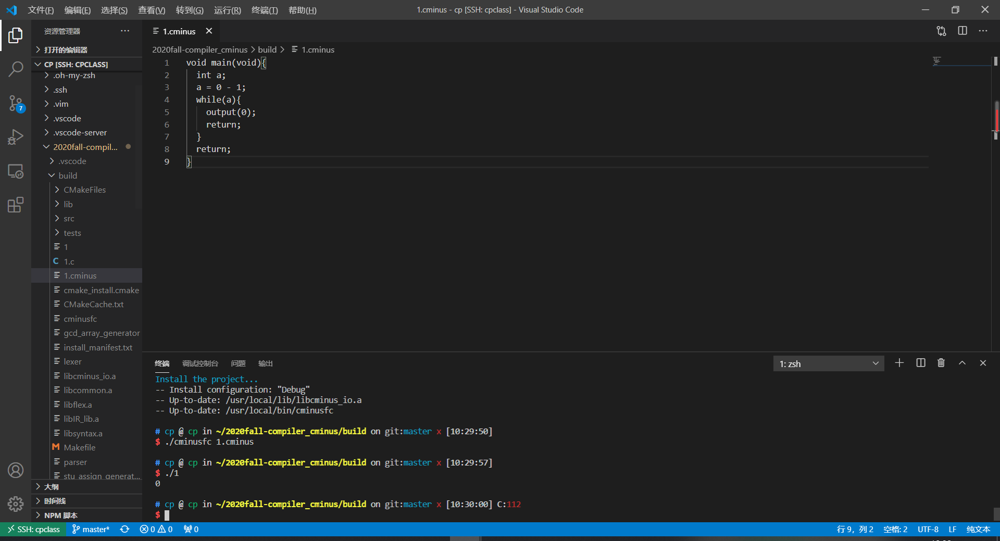
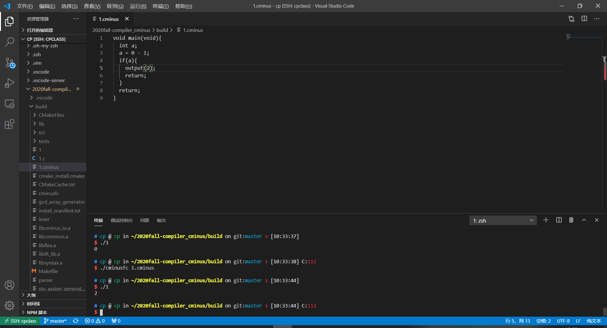
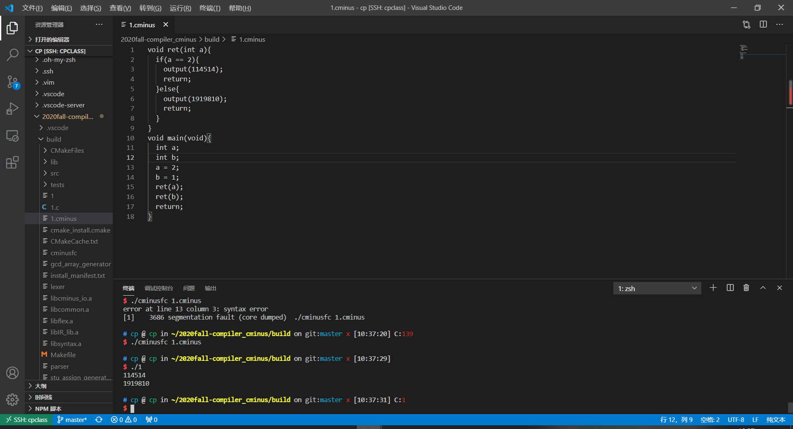
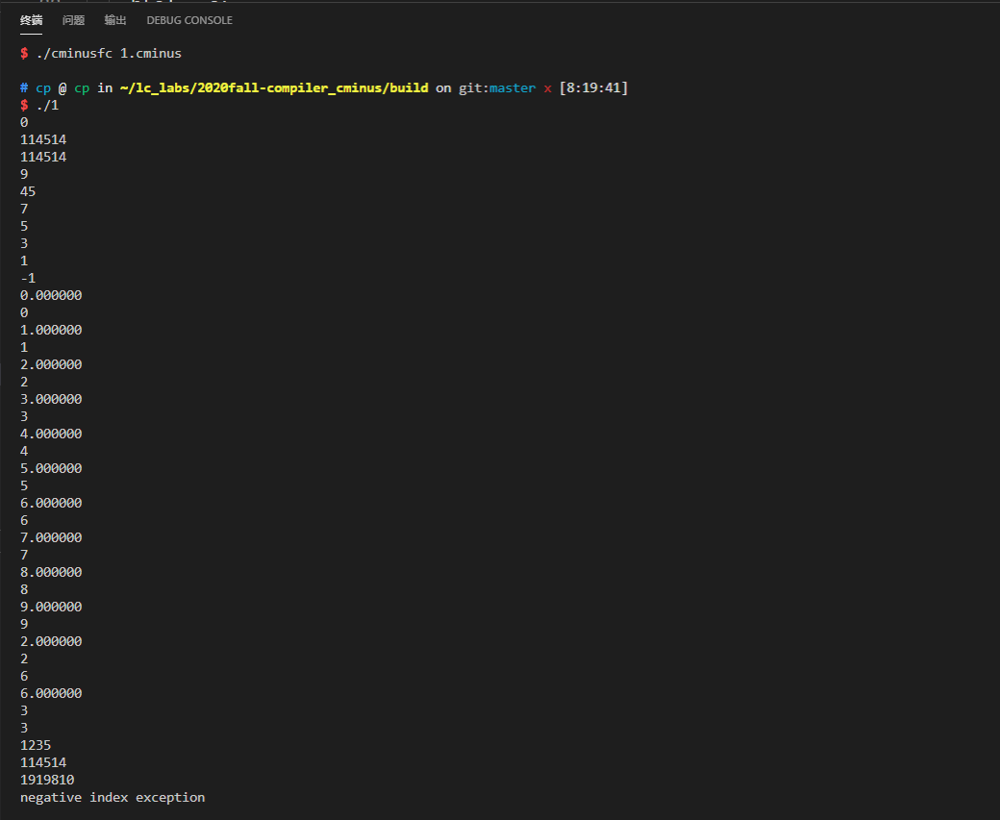

# Lab4 实验报告

李达天	PB18000294

范翔宇	PB18000006

## 实验要求

本次实验需要使用LLVM将先前实验中得到的语法树翻译为正确的LLVM IR。

根据cminusfc语法树的逻辑，采用访问者模式，用C++语言编写正确的翻译方案，得到从cminusfc语言到LLVM IR的编译器。可以正确编译cminusfc语言的代码，生成LLVM IR，并且得到正确的运行结果。

## 实验难点

首先，我们组花了较多时间理解这次实验的框架结构，了解这次实验所用语言、需要完成的实验步骤以及所需的函数。

有了以上背景知识后，难点主要是变量的定义和使用。我们需要设法解决数组如何定义，如何给数组元素赋值取值，如何作为函数参数调用和获取，如何建立全局变量。

实验测试中，我们发现存在许多函数需要判断类型，从而进行int和float的类型转换，中间需要细致地进行错误排查。

## 实验设计

#### 表示编译状态的全局变量的设计

​	在访问者模式中，遍历语法树的函数的参数和返回值都已经固定。为了实现文法属性的传递，经过考虑，本次实验设计了下列全局变量。需要指出的是，本次实验主要使用module1，区分于助教给出的module，参考的是lab3自己创建一个module的思路。value和varAlloca为Value*类型，value存储每次通过accept访问之后得到的表达式的返回值和运算值，varAlloca存储value的内存分配指针或者是数组指针；Type\*类型的paramType以及paramID分别存储函数参数的类型和参数名称，用于fun_declaration和param属性的交互；scope和gscope是符号表，分别存储局部变量和全局变量；fun为Function\*类型，代表了当前中间代码所在的函数；布尔型hasReturn变量指示if语句中是否有返回，从而确定是否有nextBB分支；整型num存储数组大小；Global存储当前访问的var是否是全局变量。

```c++
//llvm
auto module1 = new Module("cminusf");
auto builder = new IRBuilder(nullptr, module1);//add

//Type constant
Type* TyVoid = Type::get_void_type(module1);
Type* TyInt32 = Type::get_int32_type(module1);
Type* TyFloat = Type::get_float_type(module1);


PointerType* TyInt32Ptr = PointerType::get(TyInt32);
PointerType* TyFloatPtr = PointerType::get(TyFloat);
//global variables
Value* value;//expression value
Value* varAlloca;//for store value or get pointer of array
Type* paramType;//for function declaration
std::string paramId;
Scope scope;//symbol table
Scope gscope;
Function* fun;//current function for basicblock creation
bool hasReturn;//make sure if has nextBB
unsigned num;//for array declaration
bool Global;
```

#### 全局变量的定义

```c++
if(scope.in_global()){
        auto zeroInitializer = ConstantZero::get(type,module.get());
        GlobalVariable *alloca = GlobalVariable::create(node.id,module.get(),type,false,zeroInitializer);
        gscope.enter();
        gscope.push(node.id,alloca);
}
```

全局变量需要在特定的内存空间中分配和初始化为0，并push进gscope里。

#### 数组的创建、访问与传递

```c++
if(node.num != nullptr){//isarray
    node.num->accept(*this);
    type = ArrayType::get(type, num);
}
```

数组的创建需要通过指定元素类型和元素大小定义ArrayType类型，然后分全局变量和局部变量分别分配类型空间。

```c++
if(value->get_type()  ==TyInt32Ptr || value->get_type() == TyFloatPtr){//array is parameter of function
            alloca = builder->create_gep(value, std::vector<Value *>({arrayIndex}));
        }
        else{//array declare in this function or isglobal
            alloca = builder->create_gep(alloca, std::vector<Value *>({CONST_INT(0), arrayIndex}));
        }
```

在函数调用时还要对如a[]的参数进行如下处理，得到数组的基地址

```c++
if(value->get_type()->is_integer_type() != 1 && value->get_type()->is_pointer_type() != 1 && value->get_type()->is_float_type() != 1 && varAlloca != nullptr){//pointer ptr???
            value = builder->create_gep(varAlloca, {CONST_INT(0), CONST_INT(0)});
        }// pass array to function
```

当数组作为函数参数传递时需要传递形参，因此要得到指针，同时要判断类型。

```c++
if(node.isarray){// let fun_decl know param attribute type
        if(node.type == TYPE_INT){
            paramType = TyInt32Ptr;
        }else if(node.type == TYPE_FLOAT){
            paramType = TyFloatPtr;
        }else{
            paramType = TyVoid;
    }
```

#### 比较表达式数位转换

```c++
node.additive_expression_l->accept(*this);
    //node.additive_expression_l.;
    auto type1 = value->get_type();
    auto leftalloca=builder->create_alloca(TyFloat);
    if(type1->is_integer_type()){
        builder->create_store(builder->create_sitofp(value,TyFloat),leftalloca);
    }else{
        builder->create_store(value,leftalloca);
    }
    auto leftvalue = builder->create_load(leftalloca);
```

比较表达式对左值和右值的条件比较苛刻，要求必须都是同样类型的。解决办法是把左值和右值的结果判断类型后进行必要的类型转换，而后存了再取。

```c++
value = builder->create_zext(value,TyInt32);//tag zext to INT
```

得到的值需要通过zext从1bit整数型变为32bit整数型。

#### 实验设计总思路

###### 函数访问和建立模块

```c++
void CminusfBuilder::visit(ASTProgram &node) {
    for(auto decl: node.declarations){//call visit
        decl->accept(*this);
    }
 }
```

 	在 CminusfBuilder::visit(ASTprogram &node)函数中，我们只需调用accept函数，逐个访问declarations中的declaration节点。

```C++
void CminusfBuilder::visit(ASTNum &node) { //tag
    
    varAlloca = nullptr;
    if(node.type==TYPE_INT)   {num = node.i_val; value = CONST_INT(node.i_val);}
    if(node.type==TYPE_FLOAT) {num = node.f_val;value = CONST_FP(node.f_val); }
}
```

​	void CminusfBuilder::visit(ASTNum &node)函数中将节点本身的value的值传递给全局变量value（num作为表达式时）和num（num在数组定义中），同时主要区分num的类型。

```c++
void CminusfBuilder::visit(ASTVarDeclaration &node) { 
    auto type = TyInt32;
    if(node.type==TYPE_INT)   type = TyInt32; // int a
    else if(node.type==TYPE_FLOAT)  type = TyFloat;//float a
    else  type = TyVoid;
    if(node.num != nullptr){//isarray
        node.num->accept(*this);
        type = ArrayType::get(type, num);
    }
    //判断是否为全局变量
    if(scope.in_global()){
        //是则存入gscope
        auto zeroInitializer = ConstantZero::get(type,module.get());
        GlobalVariable *alloca = GlobalVariable::create(node.id,module.get(),type,false,zeroInitializer);
        gscope.enter();
        gscope.push(node.id,alloca);
    }else{
        //否则存入scope
        auto alloca = builder->create_alloca(type);
        scope.push(node.id, alloca);
    }
}
```

​	void CminusfBuilder::visit(ASTVarDeclaration &node)函数作用是变量声明。因此程序运行到此处首先判断声明变量的类型。利用node.num指针判断该变量是否为数组，并且访问num节点获得num的值，之后用ArrayType::get()得到数组类型。然后判断变量是否为全局变量，若是则将其初始化，为变量分配全局变量内存空间，并存储变量id进gscope。如果不是上述两者，则认为是局部变量，存入scope。


```c++
void CminusfBuilder::visit(ASTFunDeclaration &node) { 
    std::vector<Type *> paramTypes;
    std::vector<std::string> paramIds; // define param attributes

    for(auto param : node.params){
        param->accept(*this); // visit param node
        paramTypes.push_back(paramType);
        paramIds.push_back(paramId);
    }
    auto funtype = TyVoid;
    //判断函数类型
    if(node.type==TYPE_INT)  funtype=TyInt32;
    else if(node.type==TYPE_FLOAT) funtype=TyFloat;
    fun = Function::create(
        FunctionType::get(funtype, paramTypes),
        node.id,
        module.get()
    );//create function in llvm

    scope.push(node.id, fun);

    std::vector<Value *> args;  
    for (auto arg = fun->arg_begin(); arg != fun->arg_end(); arg++) {
        args.push_back(*arg);
    }//get args in llvm

    auto bb = BasicBlock::create(module1, "", fun);
    builder->set_insert_point(bb);

    scope.enter();//create new symbol table inheriting global value
    for (int i=0;i<args.size();i++){
        auto alloca = builder->create_alloca(paramTypes[i]); //create allocation for params
        builder->create_store(args[i], alloca); //store value to alloca
        scope.push(paramIds[i], alloca); //put into symbol table
    }

    node.compound_stmt->accept(*this);
    
    scope.exit();//distory local declaration in function
}
```

​	void CminusfBuilder::visit(ASTFunDeclaration &node)函数用于建立函数。首先设置临时数组paramTypes和paramIds；遍历节点中的params数组元素，获得参数名称和类型，存入paramTypes和paramIds，便于函数在llvm中的声明，以及后续语句中使用参数。然后调用Function::Create()函数建立llvm中的函数，并将该函数存入符号表scope中。然后遍历函数中的arg列表，获得参数值并存入args中。上述过程完成了函数参数的获取。之后建立Basicblock并调用scope.enter()创建函数内部变量的符号表。遍历args数组，分别创建变量类型的存储空间，存储变量的值和名称入符号表。最后访问compound_stmt节点，结束后调用scope.exit()抹除函数中的局部变量定义。

```c++
void CminusfBuilder::visit(ASTParam &node) { 
    paramId = node.id; //let fun_decl know param attribute name
    if(node.isarray){// let fun_decl know param attribute type
        //判断array类型
        if(node.type == TYPE_INT){
            paramType = TyInt32Ptr;
        }else if(node.type == TYPE_FLOAT){
            paramType = TyFloatPtr;
        }else{
            paramType = TyVoid;
        }

    }
    //判断类型
    else if(node.type == TYPE_INT){
        paramType = TyInt32;
    }
    else if(node.type == TYPE_FLOAT){
        paramType = TyFloat;
    }
    else{
        paramType = TyVoid;
    }
}
```

​	void CminusfBuilder::visit(ASTParam &node)函数确定函数参数名称，利用isarray判断参数类型是不是数组，注意数组仍要进一步区分其是int还是float。将值返回全局变量paramType和paramID。

###### 表达式建立模块

```c++
void CminusfBuilder::visit(ASTVar &node) {
    Global = 0;
    //先在局部变量里面找
    auto alloca = scope.find(node.id);//find its declaration
    //如果在局部变量里面没找到，再找全局变量
    if(alloca == nullptr){
        gscope.enter();
        alloca = gscope.find(node.id);
        Global = 1;
        gscope.exit();
    }
    if(node.expression != nullptr){//isarray
        std::vector<Value *> values;//
        node.expression->accept(*this);
        auto arrayIndex = value;
        
        //check negative index
        //检查错误
        auto exception = scope.find("neg_idx_except");
        auto exceptBB = BasicBlock::create(module1, "", fun);
        auto nextBB = BasicBlock::create(module1, "", fun);

        auto icmp = builder->create_icmp_ge(arrayIndex, CONST_INT(0));
        builder->create_cond_br(icmp, nextBB, exceptBB);

        builder->set_insert_point(exceptBB);
        builder->create_call(exception,values);
        builder->create_br(nextBB);

        builder->set_insert_point(nextBB);
        value = builder->create_load(alloca);
        if(value->get_type()  ==TyInt32Ptr || value->get_type() == TyFloatPtr){//array is parameter of function

            alloca = builder->create_gep(value, std::vector<Value *>({arrayIndex}));
        }
        else{//array declare in this function or isglobal
            alloca = builder->create_gep(alloca, std::vector<Value *>({CONST_INT(0), arrayIndex}));
        }
    }
    //赋值
    varAlloca = alloca;
    value = builder->create_load(varAlloca);
}
```

void CminusfBuilder::visit(ASTVar &node)函数作用是当程序需要访问变量时，能够获得变量的名称和值的指针。首先调用scope.find获得符号表中的变量id，然后通过node.expression节点是否为空，判断变量是否为数组。若不为空，说明变量为数组，访问node.expression节点获得表达式expression的返回值，即全局变量value，也即数组下标。之后用临时变量arrayIndex存储value的值，值得注意的是，确定为数组之后仍要判断是不是函数的参数，如a[]，这两种取值方式有如上差异。


```c++
void CminusfBuilder::visit(ASTSimpleExpression &node) {
     if(node.additive_expression_r == nullptr){//只有左表达式
        node.additive_expression_l->accept(*this);
        return;
    }
    node.additive_expression_l->accept(*this);
    auto type1 = value->get_type();
    auto leftalloca=builder->create_alloca(TyFloat);
    //我们决定使用fcmp，所以要注意类型转换
    if(type1->is_integer_type()){
        builder->create_store(builder->create_sitofp(value,TyFloat),leftalloca);
    }else{
        builder->create_store(value,leftalloca);
    }
    auto leftvalue = builder->create_load(leftalloca);
    node.additive_expression_r->accept(*this);
    auto type2 = value->get_type();
    auto rightalloca=builder->create_alloca(TyFloat);
    //同理
    if(type2->is_integer_type()){
        builder->create_store(builder->create_sitofp(value,TyFloat),rightalloca);
    }else{
        builder->create_store(value,rightalloca);
    }
    auto rightvalue = builder->create_load(rightalloca);
    switch(node.op){  //全部用fcmp
    case(OP_LE)://<=
        value = builder->create_fcmp_le(leftvalue,rightvalue);
        break;
    case(OP_LT)://<
        value = builder->create_fcmp_lt(leftvalue,rightvalue);
        break;
    case(OP_GT)://>
        value = builder->create_fcmp_gt(leftvalue,rightvalue);
        break;
    case(OP_GE)://>=
        value = builder->create_fcmp_ge(leftvalue,rightvalue);
        break;
    case(OP_EQ)://==
        value = builder->create_fcmp_eq(leftvalue,rightvalue);
        break;
    case(OP_NEQ)://!=
        value = builder->create_fcmp_ne(leftvalue,rightvalue);
        break;
    }
    value = builder->create_zext(value,TyInt32);//这里我把判断之后的结果，由i1类型转换成i32类型了，因为认为i1和i32都是int类型，所以后续没有函数可以判断
    //zext
}
```

   void CminusfBuilder::visit(ASTSimpleExpression &node)函数用于处理比较表达式。首先判断比较符号右端节点是否为空，若是则直接访问左节点。若否，则分别访问左右节点，获得相应的value值，用临时变量存储，同时用type1和type2保存类型。最后根据node.op的值，调用函数比较两个临时变量，将其从i1变成i32后返回全局变量value。


```c++
void CminusfBuilder::visit(ASTAdditiveExpression &node) { 
    if(node.additive_expression == nullptr){
        node.term->accept(*this);
        return;
    }

    node.additive_expression->accept(*this);
    auto leftValue = value;
    node.term->accept(*this);
    auto rightValue = value;
    switch(node.op){
    //这里加减要注意类型转换！
    case(OP_PLUS)://+
        if(leftValue->get_type()->is_integer_type() == 1 && rightValue->get_type()->is_integer_type() == 1){
            value = builder->create_iadd(leftValue, rightValue);
        }else if(leftValue->get_type()->is_float_type() == 1 && rightValue->get_type()->is_integer_type() == 1){
            value = builder->create_fadd(leftValue, builder->create_sitofp(rightValue,TyFloat));        
        }else if(leftValue->get_type()->is_integer_type() == 1 && rightValue->get_type()->is_float_type() == 1){
            value = builder->create_fadd(builder->create_sitofp(leftValue,TyFloat), rightValue);        
        }else if(leftValue->get_type()->is_float_type() == 1 && rightValue->get_type()->is_float_type() == 1){
            value = builder->create_fadd(leftValue, rightValue);        
        }
        break;
    case(OP_MINUS)://-
        if(leftValue->get_type()->is_integer_type() == 1 && rightValue->get_type()->is_integer_type() == 1){
            value = builder->create_isub(leftValue, rightValue);
        }else if(leftValue->get_type()->is_float_type() == 1 && rightValue->get_type()->is_integer_type() == 1){
            value = builder->create_fsub(leftValue, builder->create_sitofp(rightValue,TyFloat));        
        }else if(leftValue->get_type()->is_integer_type() == 1 && rightValue->get_type()->is_float_type() == 1){
            value = builder->create_fsub(builder->create_sitofp(leftValue,TyFloat), rightValue);        
        }else if(leftValue->get_type()->is_float_type() == 1 && rightValue->get_type()->is_float_type() == 1){
            value = builder->create_fsub(leftValue, rightValue);           
        }
        break; 
    
    }
}
```

  void CminusfBuilder::visit(ASTAdditiveExpression &node)函数代表计算加减乘除的表达式。与SimpleExpression逻辑相似，首先其判断additive_expression节点是否为空，若空，则直接访问代表乘除的term节点。若否，则访问additive_expression和term节点分别获得两者value的值，用临时变量存储后，根据node.op的值调用函数进行加减，最终结果返回全局变量value。此处需注意，如果leftValue和rightValue类型不一样时需进行类型转换。


```c++
void CminusfBuilder::visit(ASTTerm &node) { 
    if(node.term == nullptr){
        node.factor->accept(*this);
        return;
    }

    node.term->accept(*this);
    auto leftValue = value;

    node.factor->accept(*this);
    auto rightValue = value;
    //同样需要注意类型转换
    switch(node.op){
    case(OP_MUL)://*
        if(leftValue->get_type()->is_integer_type() == 1 && rightValue->get_type()->is_integer_type() == 1){
            value = builder->create_imul(leftValue, rightValue);
        }else if(leftValue->get_type()->is_float_type() == 1 && rightValue->get_type()->is_integer_type() == 1){
            value = builder->create_fmul(leftValue, builder->create_sitofp(rightValue,TyFloat));        
        }else if(leftValue->get_type()->is_integer_type() == 1 && rightValue->get_type()->is_float_type() == 1){
            value = builder->create_fmul(builder->create_sitofp(leftValue,TyFloat), rightValue);        
        }else if(leftValue->get_type()->is_float_type() == 1 && rightValue->get_type()->is_float_type() == 1){
            value = builder->create_fmul(leftValue, rightValue);            
        }
	    break;
	   
    case(OP_DIV):///
        if(leftValue->get_type()->is_integer_type() == 1 && rightValue->get_type()->is_integer_type() == 1){
            value = builder->create_isdiv(leftValue, rightValue);
        }else if(leftValue->get_type()->is_float_type() == 1 && rightValue->get_type()->is_integer_type() == 1){
            value = builder->create_fdiv(leftValue, builder->create_sitofp(rightValue,TyFloat));        
        }else if(leftValue->get_type()->is_integer_type() == 1 && rightValue->get_type()->is_float_type() == 1){
            value = builder->create_fdiv(builder->create_sitofp(leftValue,TyFloat), rightValue);        
        }else if(leftValue->get_type()->is_float_type() == 1 && rightValue->get_type()->is_float_type() == 1){
            value = builder->create_fdiv(leftValue, rightValue);     
        }
	    break;
    }

}
```

   void CminusfBuilder::visit(ASTTerm &node)函数功能是实现表达式的乘除运算。实现方法与上述两个函数相同，首先判断term节点是否为空，然后根据判断结果选择访问term或factor节点。通过全局变量value获得相应的返回值，由node.op大小进行乘除运算，结果返回value。同样需要进行类型判断和类型转换。


###### 分支跳转逻辑语句模块

```c++
void CminusfBuilder::visit(ASTIterationStmt &node) {
    node.expression->accept(*this);
    auto judgeBB = BasicBlock::create(module1, "", fun);
    auto continueBB = BasicBlock::create(module1, "", fun);
    auto breakBB = BasicBlock::create(module1, "", fun);
    auto iterty = value->get_type();
    Value* cmp;
    builder->create_br(judgeBB); // last bb end with jump to judegeBB
    builder->set_insert_point(judgeBB);

    node.expression->accept(*this);
    //判断类型，并且跟0比较
    if(iterty->is_integer_type() == 1){
        auto zero = CONST_INT(0);
        cmp = builder->create_icmp_ne(value, zero);
    }else{
        auto zero = CONST_FP(0);
        cmp = builder->create_fcmp_ne(value, zero);
    }
    auto br = builder->create_cond_br(cmp, continueBB, breakBB);
    hasReturn = false;
    builder->set_insert_point(continueBB);
    node.statement->accept(*this);
    if(!hasReturn){
        br = builder->create_br(judgeBB);
    }
    if(breakBB!=nullptr){
        builder->set_insert_point(breakBB);    
    }
 }
```

​	在void CminusfBuilder::visit(ASTTterationStmt &node)函数中，我们定义了判断、执行、跳出三个分支，分别用来判断while的条件是否满足，执行循环语句中的命令，以及退出循环。在判断分支中，先对expression进行访问，再根据条件icmp来判断是否进入执行分支或跳出循环分支。如果进入执行分支，则先访问statement，而后看看while主体中是否有return语句，有则直接退出。不然再进入判断分支以继续判断是否跳出while循环；如果进入跳出分支，则不需动作直接退出。


```c++
void CminusfBuilder::visit(ASTReturnStmt &node) {
     if(node.expression == nullptr){//void fun
        builder->create_void_ret();
    }
    else{
        //return的时候，要注意类型转换
        node.expression->accept(*this);
        if(fun->get_return_type()->is_integer_type() == 1 && value->get_type()->is_float_type() == 1){
            builder->create_ret(builder->create_fptosi(value,TyInt32));
        }else if(fun->get_return_type()->is_float_type() == 1 && value->get_type()->is_integer_type() == 1){
            builder->create_ret(builder->create_sitofp(value,TyFloat));
        }else{
            builder->create_ret(value);
        }
    }
    hasReturn = true;
 }
```

​	在void CminusfBuilder::visit(ASTReturn_stmt &node)函数中，分为两类，一类是直接return;没有返回值，另一类是有返回值的。对于第一类，我们返回一个空（builder->create_void_ret()）。对于第二类，我们先访问表达式expression，后返回全局变量value。修改hasReturn为true，用于强制返回。  


```c++
void CminusfBuilder::visit(ASTCall &node) {
    auto calleeFun = scope.find(node.id);
    if(calleeFun == nullptr){
        gscope.enter();
        calleeFun = gscope.find(node.id);
        gscope.exit();
    }
    Function *calleefun = (Function *)calleeFun;
    FunctionType *callee = calleefun->get_function_type();
    std::vector<Value *> values;//parameter passed to call
    int i = 0;
    for(auto arg : node.args){
        arg->accept(*this);
        Type *parTy = callee->get_param_type(i);
        //判断参数类型
        if(value->get_type()->is_integer_type()==1 && parTy->is_float_type()==1){
            value = builder->create_sitofp(value,TyFloat);
        }
        else if(value->get_type()->is_float_type()==1 && parTy->is_integer_type()==1){
            value = builder->create_fptosi(value,TyInt32);
        }
        i++;
        if(value->get_type()->is_integer_type() != 1 && value->get_type()->is_pointer_type() != 1 && value->get_type()->is_float_type() != 1 && varAlloca != nullptr){
            value = builder->create_gep(varAlloca, {CONST_INT(0), CONST_INT(0)});
        }// pass array to function
        values.push_back(value);
    }
    value = builder->create_call(calleeFun, values);
 //500行hhhh
 }
```

​	在void CminusfBuilder::visit(ASTCall &node)函数中，先在符号表中根据节点的id找到被调用的函数，随后分别读取参数列表args中的每一个参数，每读一个参数arg就用parTy记录其类型，i表示第几个参数。将Value*的数组传递给函数，再将全局变量value push进符号表。该函数中，我们用到的关键全局变量是value，既要包括每一个函数参数的值，又要填充最终整个函数的返回值。

### 额外测试

#### 测试样例1

```
void main(void){
  int a;
  a = 0 - 1;
  while(a){
    output(0);
    return;
  }  
  return;
}
```



#### 测试样例2

```
void main(void){
  int a;
  a = 0 - 1;
  if(a){
    output(2);
    return;
  }  
  return;
}
```



#### 测试样例3

```
void ret(int a){
  if(a == 2){
    output(114514);
    return;
  }else{
    output(1919810);
    return;
  }
}
void main(void){
  int a;
  int b;
  a = 2;
  b = 1;
  ret(a);
  ret(b);
  return;
}
```



#### 综合测试样例

```
int a;
int h[10];
void assign(void){
  a = 114514;
  return;
}
void printa(void){
  output(a);
  return;
}
int inttofp(int a){
  float b;
  b = a;
  outputFloat(b);
  return b;
}
void garray(int b[]) {
  output(b[3]);
  return;
}
void farray(int c[]) {
  output(c[3]);
  garray(c);
  return;
}
float fptoint(float a){
  int b;
  b = a;
  output(b);
  return b;
}
int add(int a){
  return a + 1;
}
int retinmiddlea(void){
  int i;
  i = 1;
  if(i){
    return 114514;
  }else{
    return 1919810;
  }
}
int retinmiddleb(void){
  int i;
  i = 1;
  while(i){
    return 1919810;
  }
  return 114514;
}
void main(void){
  int a;
  int c;
  int b;
  int g;
  float d[10];
  float e;
  float f;
  float i;
  /*test global*/
  printa();
  assign();
  printa();
  a = 10;
  printa();
  b = 5;
  c = 0;
  /*test if else*/
  if(a > b){
    a = a - 1;
    output(a);
  }
  if(a <= b){
    output(a + b);
  }
  else{
    output(a * b);
  }
  /*test while*/
  while(a > 0){
    a = a - 2;
    output(a);
  }
  /*test array assign*/
  while(c < 10){
    d[c] = c;
    h[c] = c;
    outputFloat(d[c]);
    output(h[c]);
    c = c + 1;
  }
  /*test type transfer*/
  /*test array fun*/
  i = inttofp(d[2]);
  output(i);
  g = fptoint(h[6]);
  outputFloat(g);
  farray(h);
  /*fun chain*/
  output(add(add(add(add(add(1230))))));
  /*return in middle*/
  output(retinmiddlea());
  output(retinmiddleb());
  /*illegal array index*/
  h[1-2] = 1;
  return;
}
```



### 实验总结

通过这次实验，我们两人深入认识了llvm编译器工作原理和语法框架，熟悉IR文法的基本内容；学会使用c++语言，根据不同语言的语法树，编写需要的翻译方案，生成正确的LLVM IR。并且，在debug的过程中，我们俩能相互交流、相互学习，查漏补缺，改善思维和代码中的漏洞，对于编译器如何工作、语法树代表的语法规则产生更直观的认识。同时我们的调试能力在一次次的debug中得到了不小的提升，还学会自己寻找特殊样例进行测试。

### 实验反馈 （可选 不会评分）

### 组间交流 （可选）