# Lab5 实验报告

小组成员 姓名 学号

队长	李达天	PB18000294

队员	范翔宇	PB18000006

## 实验要求

开发基本优化Pass：常量传播，循环不变式外提和活跃变量分析

## 实验难点

常量传播对不同的指令需要不同的处理，尤其phi的加入造成了较大干扰；循环不变式外提难点在于如何判断语句与循环无关，且外提不会有副作用，以及如何判断应该外提到哪层循环；活跃变量难点则在于如何确定每个bb块的def、use以及OUT和IN，而且还有具体如何实现迭代计算算法的同时特殊处理phi指令。

## 实验设计

* 常量传播
    实现思路：对不同的指令进行相应的操作的同时，判断其右值是否是明确的值；如果是则将其插入val_stack中，并遍历所有phi指令，如果operand用到了这个右值，则将其替换。最后删除该条指令。注意，全局变量的store不进行删除，因为其他地方可能会用。
    
    相应代码：
    
    首先对遍历一遍对if，while，phi进行预处理
    
    ```c++
    for(auto func_ : this->m_->get_functions()){
            if(func_->get_num_basic_blocks()!=0){
            }
            for(auto bb : func_->get_basic_blocks()){
                flag = 0;
                for(auto instr : bb->get_instructions()){
                    if(instr->is_phi()){
                        flag = 1;
                        phistack[instr].push_back(instr);
                    }
                    if(instr->is_br()){
                        if(instr->get_num_operand() == 3 && flag == 1){//有phi，是while的判断循环块
                            judegstack[bb->get_name()].push_back(bb);
                            auto bbsucc = (BasicBlock *)(instr->get_operand(1));
                            whilestack[instr->get_operand(1)->get_name()].push_back(bbsucc);
                            //whilestack[]
                            //if的可以直接判断，我就不做特殊处理了，判断好，直接delete就行，但是while不行
                        }
                    }
                }
            }
        }
    ```
    
    而后遍历每个bb块的每个指令进行遍历，以add指令为例进行说明，其他的类似。首先完成加法操作，而后遍历所有bb块中的phi指令，如果operand中用到该add指令的右值，则将其替换。最后删除该add指令。
    
    ```
    if(instr->is_add()){
                        if(cast_constantint(instr->get_operand(0))!=nullptr && cast_constantint(instr->get_operand(1))!= nullptr){
                            auto a = (ConstantInt *)(instr)->get_operand(0);
                            auto b = (ConstantInt *)(instr)->get_operand(1);
                            auto c = a->get_value() + b->get_value();
                            valstack[instr->get_name()].push_back(CONST_INT(c));
                            for(auto bb2 :func_->get_basic_blocks()){
                            for(auto instr2: bb2->get_instructions()){
                                if(instr2->is_phi()){
                                    auto r_vals = instr2->get_operands();
                                    int i = 0;
                                    for(auto r_val : r_vals){
                                        auto r_str = r_val->get_name();
                                        if(valstack.find(r_str)!=valstack.end()){
                                            auto b = valstack[r_str].back();
                                            auto b_to_print = (Instruction *)b;
                                            instr2->set_operand(i, b);
                                        }
                                        i++;
                                    }
                                }
                            }
                            }
                            wait_delete.push_back(instr);
                        }                    
                    }
    ```
    
    load指令只需简单地压栈，删除即可
    
    ```
    if(instr->is_load()){
                        auto a = instr->get_operand(0);
                        auto l_val = instr->get_name();
                        if(globalstack.find(a->get_name()) != globalstack.end()){
                            valstack[instr->get_name()].push_back(globalstack[a->get_name()].back());
                            wait_delete.push_back(instr);
                        }
                    }
    ```
    
    phi函数需要对所有的operand寻找是否在val_stack中，若在则替换。
    
    ```
    if(instr->is_phi()) {
                        auto r_vals = instr->get_operands();
                        int i = 0;
                        for(auto r_val : r_vals){
                            auto r_str = r_val->get_name();
                            if(valstack.find(r_str)!=valstack.end()){
                                auto b = valstack[r_str].back();
                                instr->set_operand(i, b);
                                i++;
                            }
                        }
                    }
    ```
    
    br指令较为复杂，因为可能涉及到while和if，对于不会进入的bb块，我们先将原来的操作树remove，再add上唯一 进入的bb块，这样便实现了强制性跳转。
    
    ```
    if(instr->is_br()){
                        if(instr->get_num_operand() == 3){
                        if(judge == 1){
                            auto a = instr->get_operand(0)->get_name();
                            if(valstack.find(a) != valstack.end()){
                                auto b = valstack[a].back();
                                if(b == 0){//进不去while的循环块，我就给删了
                                    auto deletebbname = instr->get_operand(1)->get_name();
                                    auto deletebb = whilestack[deletebbname].back();
                                    deletestack[deletebbname].push_back(deletebb);
                                    auto enterbb = (BasicBlock*)instr->get_operand(2); 
                                    instr->remove_operands(0,2);
                                    instr->add_operand(enterbb);
                                    //func_->remove(deletebb);
                                }
                            }
                        }else{
                                if(instr->get_operand(0) == 0){
                                    auto deletebbname = instr->get_operand(1)->get_name();
                                    auto deletebb = (BasicBlock* )instr->get_operand(1);
                                    deletestack[deletebbname].push_back(deletebb);
                                    auto enterbb = (BasicBlock*)instr->get_operand(2);
                                    instr->remove_operands(0,2);
                                    instr->add_operand(enterbb);
                                    //func_->remove(deletebb);  
                                }else{
                                    auto deletebbname = instr->get_operand(2)->get_name();
                                    auto deletebb = (BasicBlock* )instr->get_operand(2);
                                    deletestack[bb->get_name()].push_back(bb);
                                    auto enterbb = (BasicBlock*)instr->get_operand(1);
                                    instr->remove_operands(0,2);
                                    instr->add_operand(enterbb);
                                }
                        }
                        }
                    }
    ```
    
    
    
    优化前后的IR对比（举一个例子）并辅以简单说明：
    
    以以下测试样例为例
    
    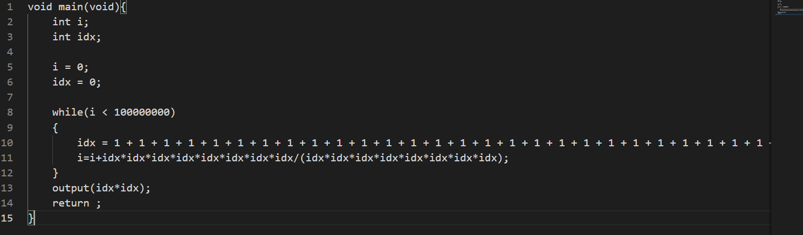
    
    优化前的结果如下：
    
    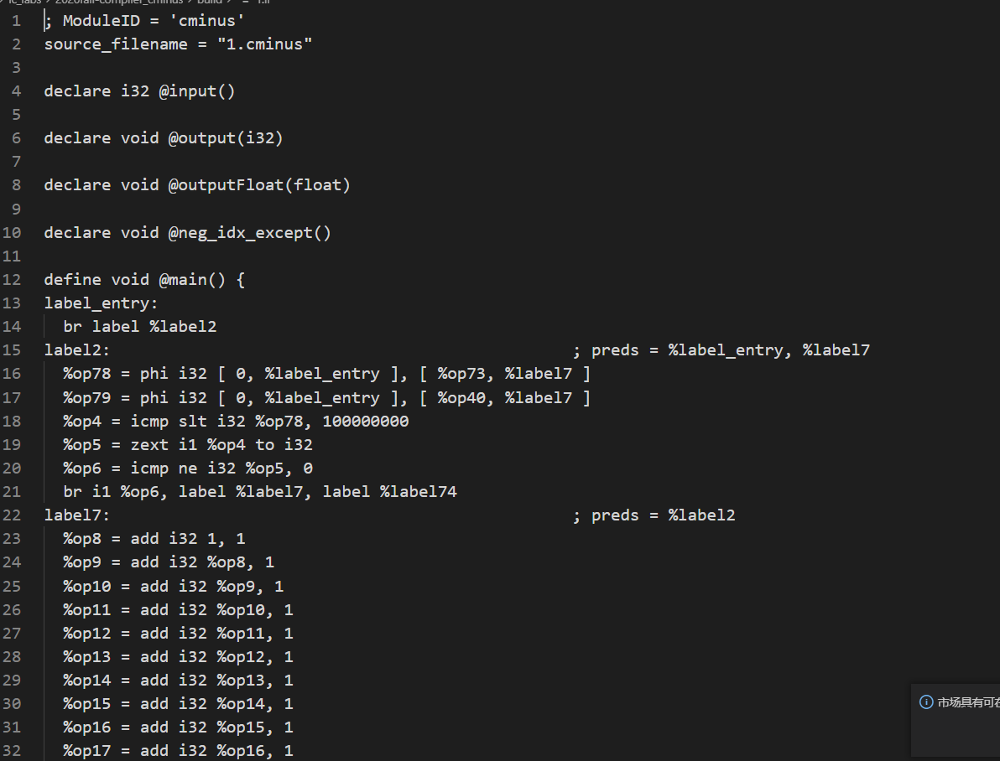
    
    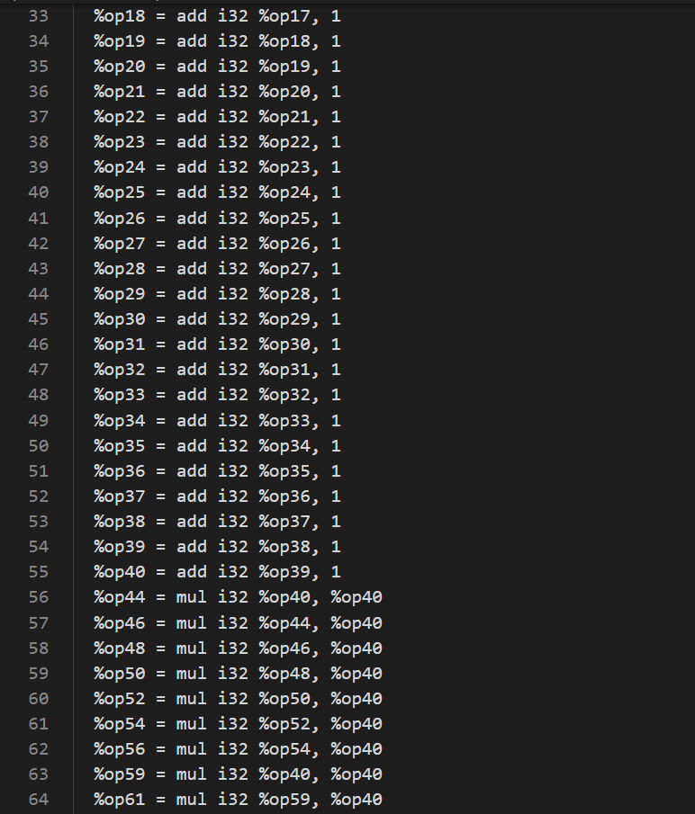
    
    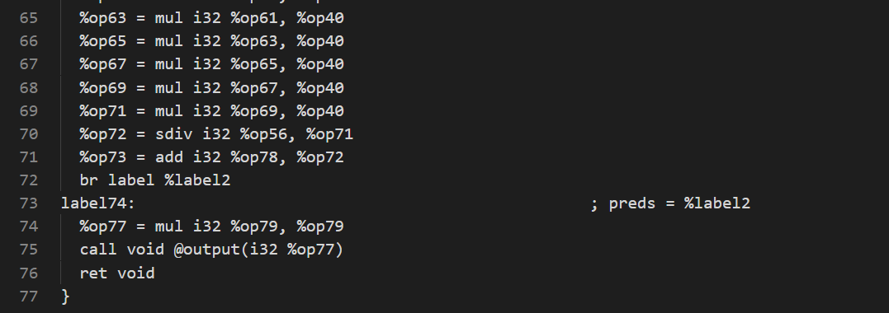
    
    
    
    
    
    优化后的结果如下：
    
    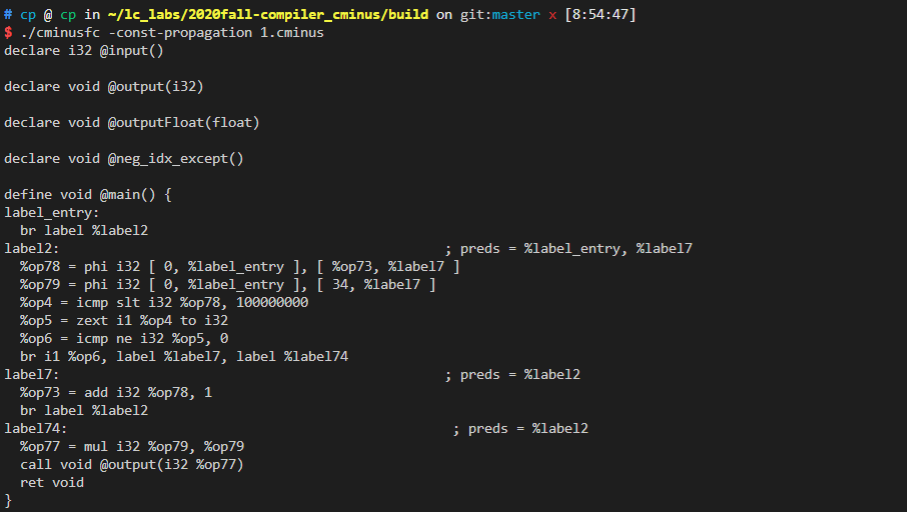
    
    对比可见，将idx那一长串赋值传播为34，写入phi中，还有i的赋值中后面的mul和sdiv计算也传播成1，直接i=i+1，并删掉了大量add和mul指令。
    
    跑助教的py测试文件结果如下：
    
    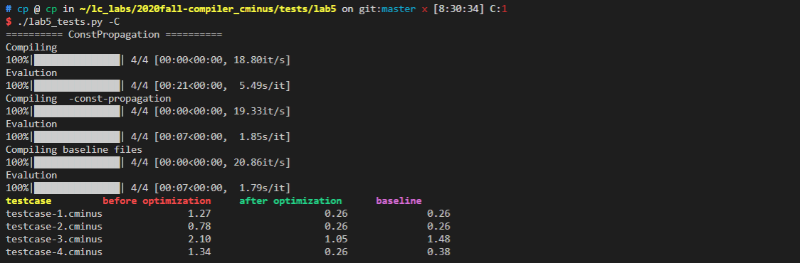


* 循环不变式外提
    实现思路：对每一层循环都遍历其bb块，然后将其右值存进set中；而后遍历第二次，如果右值在set中找到，证明不能外提，否则将其外提到该循环入口块不属于该循环的前驱。当然这可能带来的副作用是可能带来新的可以外提的指令，因此递归调用run()函数，直至找不到可以外提的指令。
    相应代码：
    
    首先遍历该循环的所有bb块的所有左值，将其插入left中
    
    ```cpp
    for(auto bb1: **x) {
                for(auto instr1:bb1->get_instructions()){
                    auto l_val = (Value *)instr1;
                    left.insert(l_val);
                }
            }
    ```
    
    对每条指令，遍历所有operand，只要任何一个operand能在left中找到，都说明不要外提
    
    ```
    				auto r_vals = instr2->get_operands();
                    int tol=0;
                    for(auto r_val : r_vals){
                        auto r_to_print=(Instruction *)r_val;
                        auto constant_ptr = dynamic_cast<Constant *>(r_val);
                        if(constant_ptr)    continue;
                        if(left.find(r_val)!=left.end())
                        {
                            tol++;
                        }
                    }
    ```
    
    若某条指令的tol等于0表示需要外提，寻找到该循环入口块不属于该循环的前驱，将其中的br指令删除（为了让br在bb块的最后），而后插入该条指令，再插入br指令。
    
    ```c++
    				if(instr2->is_phi()==0&&instr2->is_br()==0&&instr2-	>is_ret()==0&&instr2->is_cmp()==0&&instr2->is_zext()==0)
                    {
                        if(tol==0){
                                auto q=*x;
                                auto base = loop_searcher.get_loop_base(q);
                                auto pre = base->get_pre_basic_blocks();
                                for(auto bb3: pre){
                                    if(q->find(bb3)==q->end()) { 
                                        auto ins = bb3->get_instructions();
                                        auto des_in = instr2;
                                        for(auto in: ins){
                                            if(in->is_br()==1)  {
                                                des_in = in;
                                                bb3->delete_instr(in);
                                                break;
                                            } 
                                        }
                                        bb3->add_instruction(instr2);
                                        bb3->add_instruction(des_in);
                                        bb2->delete_instr(instr2);
                                        i=1;
                                    }
                                }
                    }
                    }
    ```
    
    如果i不等于0，则递归调用run()函数，因为说明有指令发生外提，可能带来副作用
    
    ```c++
    if(i!=0) run();
    ```
    
    
    
    优化前后的IR对比（举一个例子）并辅以简单说明：
    
    以以下测试样例为例
    
    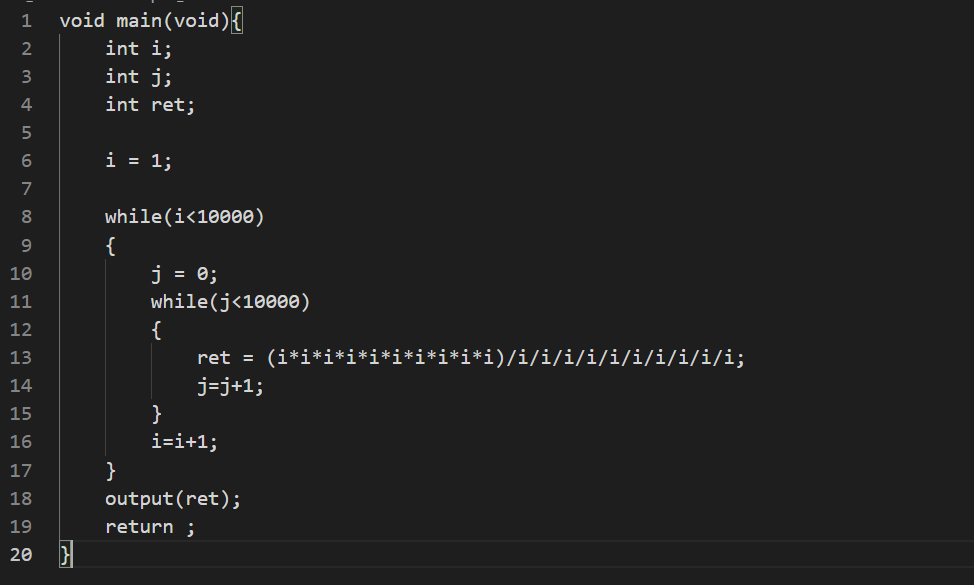
    
    优化前的ll文件如下：
    
    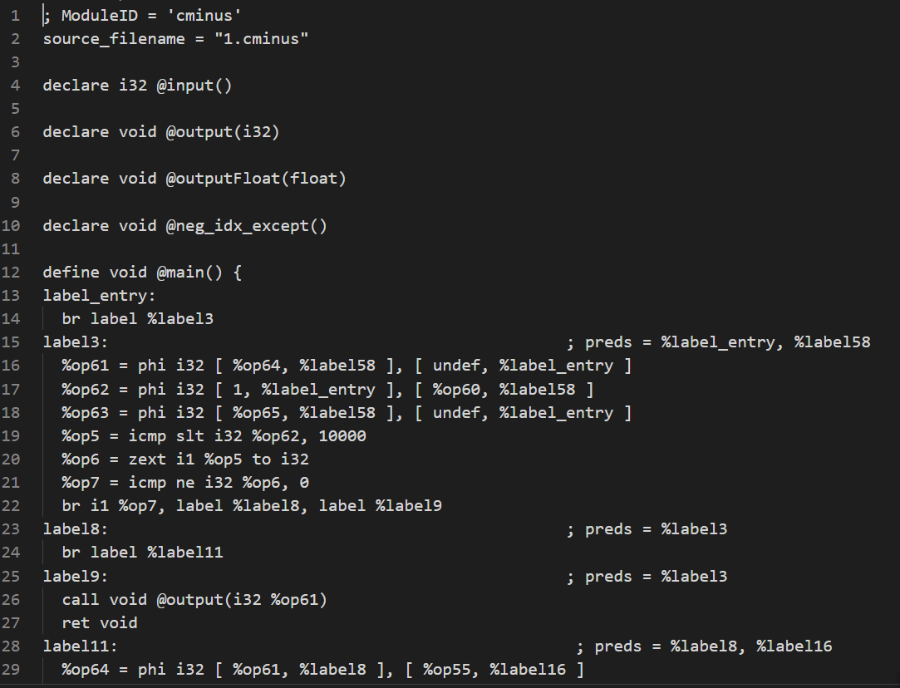
    
    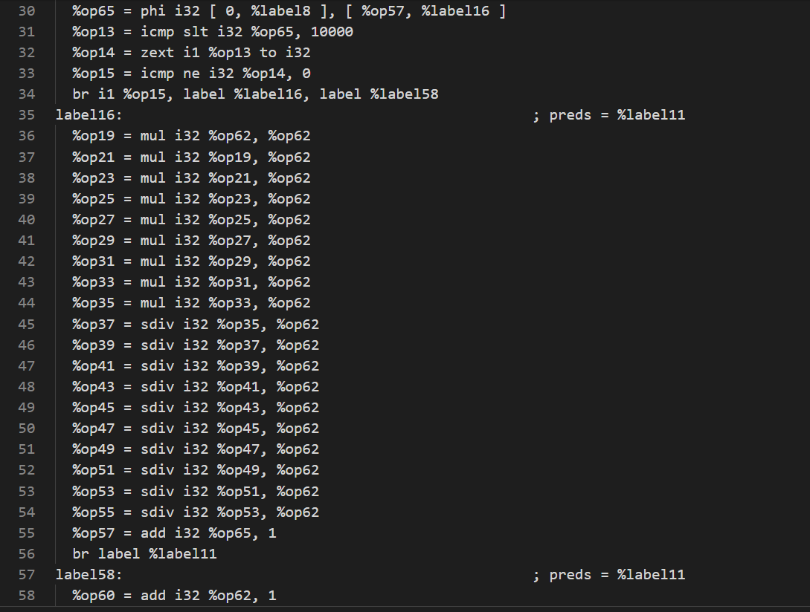
    
    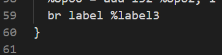
    
    优化后的ll文件如下：
    
    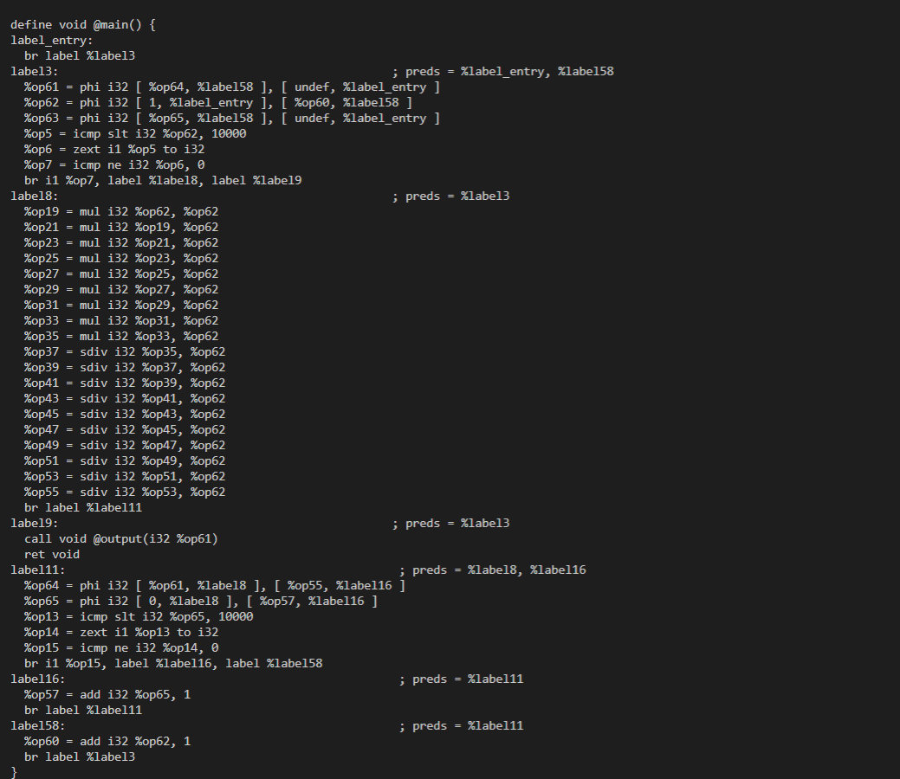
    
    对比可知，将label16的mul和sdiv指令外提到了label18，即将ret外提，因为i在内层循环中没被赋值
    
    跑助教py的测试文件结果如下：
    
    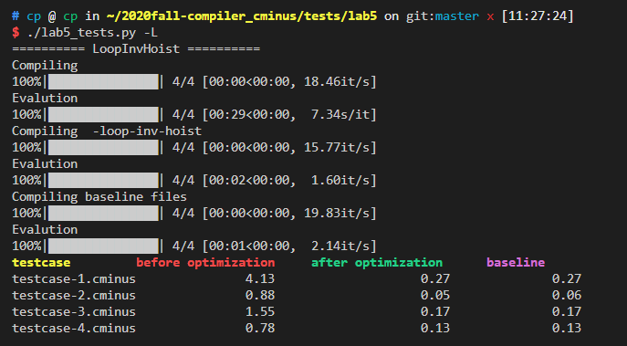


* 活跃变量分析
    实现思路：
    
    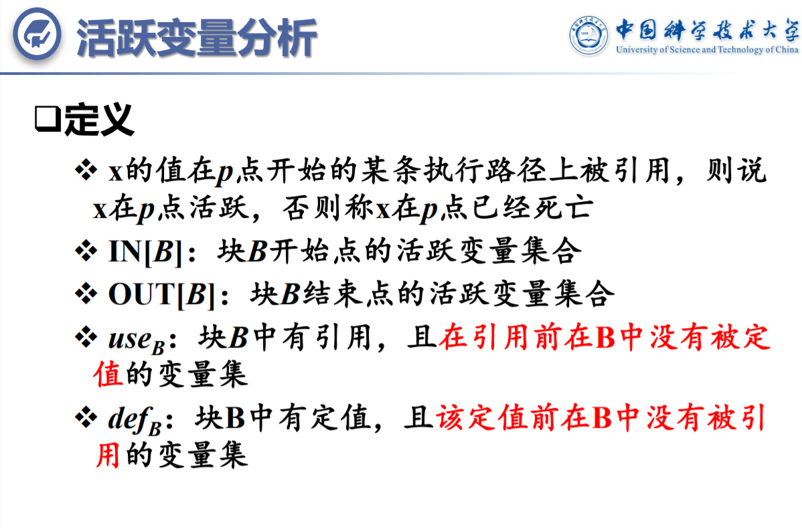
    
    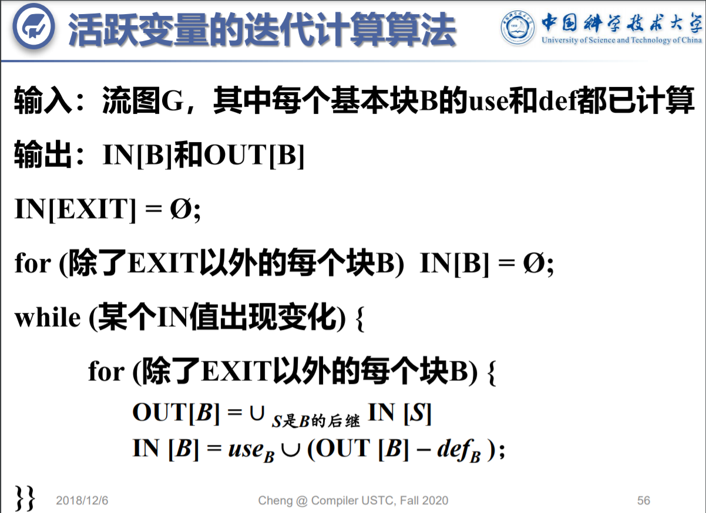
    
    根据slides，我们要先求每个bb块中的use和def。具体实现时，对bb块的指令进行遍历，对于每条指令，我先判断右值有没有符合条件(这里符合条件为不是常数或者要跳转的label，也不是要调用的函数以及alloca，剩下的只有“op”这种操作符)的operand，如果这些operand不在def中，即之前未定义我就存入use。然后再判断指令的左值(instr)是否在use中，如果不在并且符合条件也是operand，我就存入def。所有函数的每个bb块都求好use和def后，我们再根据算法对每个函数执行如上算法，由于phi函数的引用，我们需要在处理OUT[B]之前，遍历B的每个后继时，判断B的后继中是否有phi指令，并且判断phi指令中的两个label哪个等于B，并且把不等于B的label的数值存入notuse[B]中。然后在执行OUT[B]＝∪IN[S]\(S是B的后继)时，在遍历IN[S]的同时，判断IN[S]中的op是否在notuse[B]中，不在才存入OUT[B]。IN[B]则按照原式正常处理，这样就完成了OUT[B]和IN[B]的寻找。
    
    相应的代码：
    
    定义use、def以及notuse，便于后续使用
    
    ```cpp
    std::map<BasicBlock*, std::set<Value *>> use;
    std::map<BasicBlock*, std::set<Value *>> def;
    std::map<BasicBlock*, std::set<Value *>> notuse;
    ```
    
    这里是寻找use和def，遍历指令，筛选符合条件的operand存入use。我把alloca单独拎出来判断的原因是alloca没有operand根本进不去最内层for循环，第二个if条件中的分别判断的是labe、常数、call调用的function。而且之前不在use中，并且没有定义(不在def中)就存入use。然后判断指令的左值，这里用instr指代左值，如果不是跳转指令或者调用函数指令(如果是调用函数指令则函数返回类型不应该为空)以及返回指令，而且没有被use，就存入def。
    
    ```cpp
                for(auto bb : func_->get_basic_blocks()){
                    for(auto instr : bb->get_instructions()){
                        if(instr->is_alloca()){
                            if(use[bb].find(instr) == use[bb].end()){
                                def[bb].insert(instr);
                            }
                        }
                        for(auto op : instr->get_operands()){
                            auto constantint = dynamic_cast<ConstantInt *>(op);
                            auto constantfp = dynamic_cast<ConstantFP *>(op);
                            if(!op->get_type()->is_label_type() &&constantint== nullptr && constantfp == nullptr && !op->get_type()->is_function_type()){
                                if(use[bb].find(op) == use[bb].end()){//在引用前没有定值
                                    if(def[bb].find(op) == def[bb].end()){
                                        use[bb].insert(op);
                                    }
                                }
                            }
                            if(use[bb].find(instr) == use[bb].end() && !instr->is_br() && (!instr->is_call() || (instr->is_call() && !instr->get_type()->is_void_type()))  && !instr->is_ret()){
                                //在定值前，没有引用
                                def[bb].insert(instr);
                            }
                        }
                    } 
                }
    ```

下面是算法中的while循环，我通过flag来判断是否有bb块的IN发生变化，后续如果有则flag置1。

ps：接下来介绍的代码，都在此while循环和for循环中。

```cpp
            int flag = 1;
            while(flag == 1){
                flag = 0;
                for(auto bb : func_->get_basic_blocks()){
                for(auto bbsucc : bb->get_succ_basic_blocks()){//OUT[B]=IN[S]的并集 S是B的后继块
				*******
			}
```

这里我通过a来判断是否有phi指令中，没用到的假活性的块。遍历bb每个后继块的指令，看其中是否有phi函数。phi中第一个跟第三个操作数是label，第零和第四个则是对应的数。找一下有没有不等于bb的，不等于bb的label对应的数是假活性的，就存到notuse中。如果a == 0，则说明这个后继块中live_in存的都是真活性的操作数，就直接存入OUT[bb]即可。如果a == 1，则说明有假活性的，并且存live_in的操作数时都要判断是不是在notuse中存在，不存在则放心存入。

```cpp
					int a= 0;
                    for(auto instr: bbsucc->get_instructions()){
                        if(instr->is_phi()){
                                //记录phi跳转的块，以及跳转对应的值
                            if(instr->get_num_operand() == 4){
                                auto truebb = instr->get_operand(1);
                                auto trueop = instr->get_operand(0);
                                auto falsebb = instr->get_operand(3);
                                auto falseop = instr->get_operand(2);
                                if(truebb == bb && falsebb == bb){

                                }
                                if(truebb == bb && falsebb != bb){//不要falsebb的
                                    notuse[bb].insert(falseop);
                                    a = 1;
                                }
                                if(falsebb == bb && truebb != bb){
                                    notuse[bb].insert(trueop);
                                    a = 1;
                                }
                                if(truebb != bb && falsebb != bb){
                                    a = 1;
                                    notuse[bb].insert(trueop);
                                    notuse[bb].insert(falseop);
                                }
                            }else{
                                auto onlyop = instr->get_operand(0);
                                auto onlybb = instr->get_operand(1);
                                if(onlybb != bb){
                                    notuse[bb].insert(onlyop);
                                    a = 1;
                                }
                            }
                        }
                    }
                    if(a == 0){
                        for(auto insucc : live_in[bbsucc]){
                            live_out[bb].insert(insucc);
                        }
                    }else{
                        for(auto insucc : live_in[bbsucc]){
                            if(notuse[bb].find(insucc) == notuse[bb].end()){
                                live_out[bb].insert(insucc);
                            }
                        }
                        notuse[bb].clear();
                    }
```

下面这些已经跳出了对bb后继块的遍历，仍在对bb块的遍历中。IN[bb]操作起来就没这么复杂，不用考虑phi，按照算法来即可。先存在OUT[bb]但是不在def中的操作数，并且flag置1，即IN发生变化。然后再存在use中的。

```cpp
                for(auto notdef : live_out[bb]){
                    if(def[bb].find(notdef) == def[bb].end() && live_in[bb].find(notdef) == live_in[bb].end()){//不在def中，而且也不在live_in
                        live_in[bb].insert(notdef);
                        flag = 1;
                    }
                }
                for(auto useb : use[bb]){
                    if(live_in[bb].find(useb) == live_in[bb].end()){
                        live_in[bb].insert(useb);
                        flag = 1;
                    }
                }
```

大致思路就是这样，核心还是def和use的定义、以及活跃变量的迭代计算算法还有phi函数的特殊处理。

结果展示：

先跑testcase-1，如图，可以清晰的看到，二者除了label顺序有变外，其他内容一致。

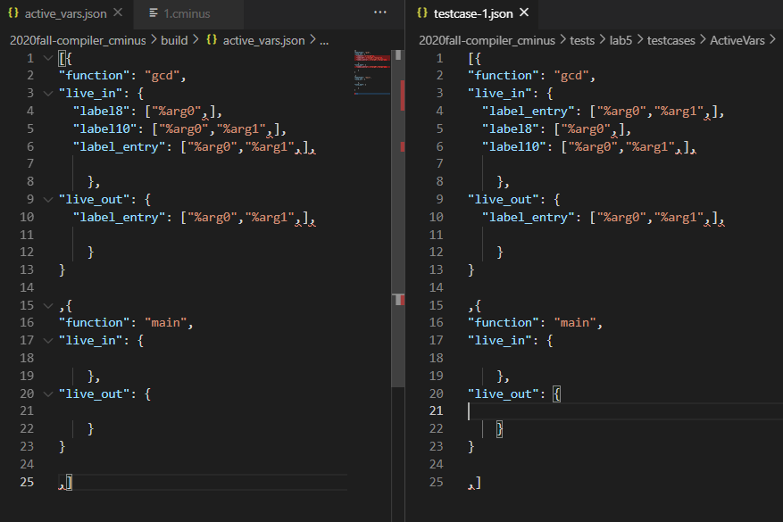

再跑testcase3，同样也可以清晰检验结果

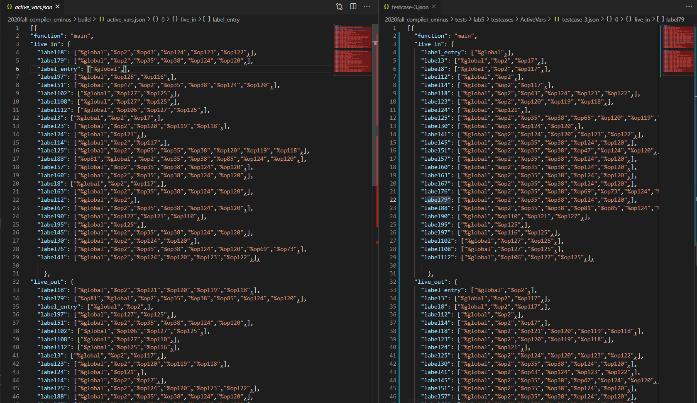

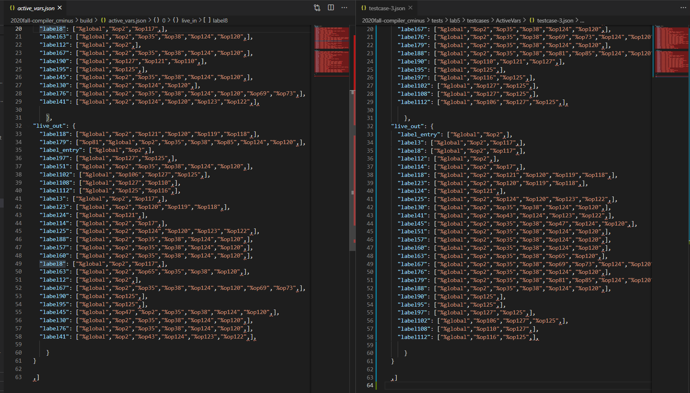

TA也可以自行检验testscase2和4，在这里不做赘述。

最终跑脚本结果全对

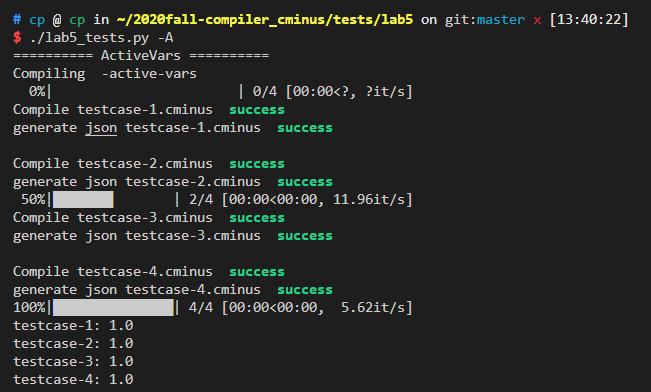

### 实验总结

通过这次实验，我们两人深入认识了优化的基本流程，掌握如何开发基于LightIR的优化Pass；熟悉c++语言的使用，学会如何使用map、vector、set等。并且，在debug的过程中，我们俩能相互交流、相互学习，查漏补缺，改善思维和代码中的漏洞，对于编译器如何优化代码产生更直观的认识。同时我们的调试能力在一次次的debug中得到了不小的提升，还学会自己寻找特殊样例进行测试。

### 实验反馈 （可选 不会评分）

### 组间交流 （可选）
